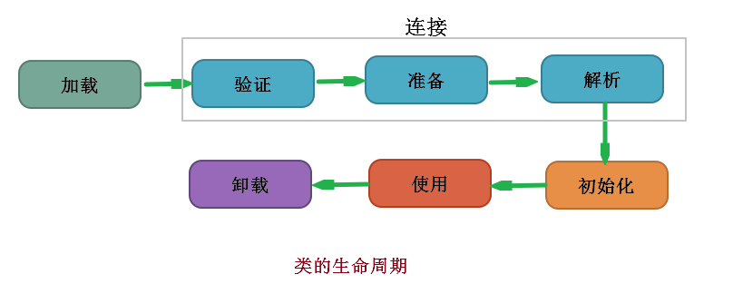
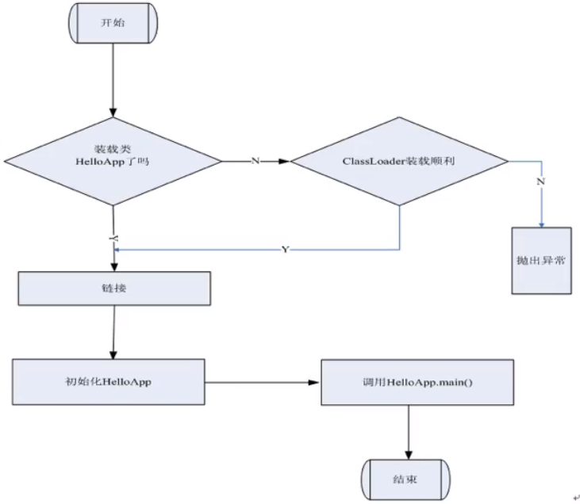

# 类加载器

## 类加载器深入解析与阶段分解
    1. 概述
        * 在java代码中，类型的加载、连接与初始化过程都是在程序运行期间完成的。
            * 类型：指我们定义的class，interface，enum等

            * 加载：最常见的情况是指将已经存在字节码文件从硬盘加载到内存

            * 连接：将类与类之间的关系进行确立，并且对字节码文件进行处理（如验证、校验）等

        * 提供了更大的灵活性，增加了更多的可能性

    2. 类加载器的剖析
        * Java虚拟机与程序的生命周期

        * 在下面几种情况下，Java虚拟机将结束生命周期
            <1> 执行了System.exit()方法
            
            <2> 程序正常执行结束

            <3> 程序正在执行过程中遇到了异常或错误而异常终止

            <4> 由于操作系统出现错误而导致Java虚拟机进程终止

    3. 类加载的五个过程
        * 加载：查找并加载类的二进制数据

        * 连接：
            <1> 验证：确保被加载类的正确性

            <2> 准备：为类的静态变量分配内存，并将其初始化为默认值
                * 举例：当你定义一个变量时，首先会有一个默认值（这就是在这一步实现的）如：整型的默认值为0等

            <3> 解析：把类中的符号引用转换为直接引用

        * 初始化：为类的静态变量赋予正确的初始值

        * 使用：正常使用

        * 卸载：销毁该类

## 类的加载连接与初始化过程详解
    1. 类的加载流程图



    2. 类的加载连接与初始化过程
        * Java程序对类的使用方式分为两种

            * 主动使用(7种)
                <1> 创建类的实例（创建对象）

                <2> 访问某个类或者接口的静态变量，或者对该静态变量赋值

                <3> 调用类的静态方法

                <4> 反射（如：class.forname("com.test.Test")）

                <5> 初始化一个类的子类

                <6> java虚拟机启动时被标明为启动类的类（JavaTest）可以理解为包含带有main方法的类

                <7> jdk1.7开始提供的动态语言支持：
                        * java.lang.invoke.MethodHandle实例的解析结果REF_getStatic, REF_putStatic,REF_
                          invokeStatic句柄对应的类没有初始化，则初始化

            * 被动使用
                * 除了以上七种情况，其他使用Java类的方式都被看作是对类的被动使用，都不会导致类的初始化

                * 注意：这里只是不会导致类的初始化，但是可能会实现类加载的其他几个过程

        * 所有的Java虚拟机实现必须在每个类或接口被Java程序“首次主动使用”时才初始化它们

        * 对于主动使用与被动使用的实现的举例：

```java
/**
 * 声明一个测试类，用于演示类加载与初始化（主动使用与被动使用）  
 *
 *          结论：对于静态字段来说，只有直接定义了该字段的类才会被初始化
 *               当一个类在初始化时，要求其父类全部都已经初始化完毕了
 */
public class Test1 {
    public static void main(String[] args) {
        System.out.println(child.str);              //子类并没有主动使用，所以没有被初始化
//          输出：
//          父类的静态代码块
//          Hello


        //System.out.println(child.str2);           //属于主动使用的第5中情况
//         输出：
//        父类的静态代码块
//        子类的静态代码块
//        World
    }

}

//声明一个父类
class Parent {
    public static String str = "Hello";

    static {
        System.out.println("父类的静态代码块");
    }
}

//声明一个子类继承了Parent

class child extends Parent{
    public static String str2 = "World";

    static {
        System.out.println("子类的静态代码块");
    }
}
```


    3. 类的加载
        * 类的加载是指将类的字节码文件中的二进制数据读入到内存中，将其放在运行时数据区的方法区内，然后再内存中
          创建一个java.lang.Class对象（规范并未说明Class对象位于哪里，HotSpot虚拟机将其放在了方法区中）用来
          封装类在方法区内的数据结构

        * 加载.class文件的方式
            <1> 从本地系统中自直接加载

            <2> 通过网络下载.class文件

            <3> 从zip,jar等归档文件中加载.class

            <4> 从专有的数据库中提取.class文件

            <5> 将java源文件动态的编译为.class文件


## 常量的本质含义与反编译及助记符详解
    1. JVM参数的三种形式
        <1> -xx:+<option>,开启option选               
        <2> -xx:-<option>,关闭option选项
        <3> -XX:<option>=<value>，表示将option选项设置为value

        如：--XX:+TraceClassLoading：用于追踪类的加载信息并打印出来

    2. 常量在编译阶段会存入到调用这个常量的方法所在的类的常量池中，本质上调用类并没有直接引用到定义常量的类，因此
       并不会触发定义常量的类的初始化

## 编译期常量与运行期常量的区别及数组创建的本质分析
    1. 当一个常量的值并非编译期可以确定，那么其值就不会放到调用类的常量池中，这时在程序运行时，会导致主动使用这个
       常量所在的类，所以会导致这个类被初始化。

    2. 对于数组实例来说，其类型是由JVM在运行期动态生成的，表示为[Lcom.arbonkeep.classloader.MyParent4这种形式。
       动态生成的类型，其父类型就是Object

       对于数组来说，JavaDoc经常将构成数组的元素为Component，实际上就是将数组降低一个维度后的类型

## 接口初始化规则与类加载器准备阶段和初始化阶段的重要意义分析
    1. 当一个接口在初始化时，并不要求其父接口都完成了初始化，只有真正使用到父接口的时候（如：引用接口中所定义的常
       量时）才会被初始化

    2. 注意：
        * 接口中的变量默认为常量，即使没有被final修饰，默认也会被final修饰。

    3. 问题：为什么在演示接口与接口之间时，删除字节码文件依然可以访问变量？而在类与类之间的继承中却不行？
        * 这是因为类与类之间继承属于主动访问，需要类的初始化，同时没有将变量声明为final修饰的，而接口中定义的变量
          为常量可以直接从常量池中访问

    4. 类初始化与接口初始化的区别
        * 类在初始化的时候要求其父类一定需要初始化，但是接口在初始化的时候并不要求其父接口一定被初始化，只有在真正
          使用到父接口时才需要被初始化

## 类加载器深入解析及重要特性剖析
    1. 类加载的流程图



    2. 类加载的详细过程
        <1> 加载：就是把二进制形式的java类型读入java虚拟机中

        <2> 验证：确保被加载类的正确性

        <3> 准备：为变量分配内存，设置默认值。但是在到达初始化之前，类变量都没有初始化为真正的初始值

        <4> 解析：解析过程就是在类型的常量池中寻找类、接口、字段和方法的符号引用，把这些符号引用替换成直接引用的过程

        <5> 初始化：为类变量赋予正确的初始值

        <6> 类实例化：为新对象分配内存；为实例变量赋默认值；为实例变量赋正确的初始值

        <7> 垃圾回收与对象终结

    3. 注意：
        * java编译器为它编译的每一个类都至少生成一个实例初始化方法，在java的class文件中，这个实例初始化方法被称为
          “<init>”。针对源代码中的每一个类的构造方法，java编译器都产生一个<init>方法

    4. 类的加载
        * 类的加载的最终产品是位于内存中的class对象

        * Class对象封装了类在方法区内的数据结构，并且向java程序员提供了访问方法区内的数据结构的接口

        * 类加载器的两种类型
            <1> Java虚拟机自带的类加载器
                * 根类加载器（Bootstrap），也叫启动类加载器
                * 扩展类加载器（Extension）
                * 系统（应用）类加载器（System）
            
            <2> 用户自定义的类加载器
                * java.lang.ClassLoader的子类
                * 用户可以定制类的加载方式

        * 类加载器并不需要等到某个类被首次主动使用时再加载它

        * JVM规范允许类加载器在预料某个类将要被使用时就预先加载它，如果在预先加载过程中遇到了.class文件缺失或存在
          错误，类加载器必须在程序首次主动使用该类时才报告错误（LinkageError）如果这个类一直没有被程序主动使用，
          那么类加载器就不会报告错误

    5. 类的验证
        * 类被加载后，就进入连接阶段。连接就是将已经读入到内存的类的二进制数据合并到虚拟机的运行时环境中去

        * 类的验证的重要内容
            <1> 类文件结构检查

            <2> 语义检查

            <3> 字节码验证

            <4> 二进制兼容性的验证

            。。。

    6. 类的准备
        *　在准备阶段，java虚拟机为类的静态变量分配内存，并设置默认的初始值。
            * 举例如下：
                * 在下列java代码中，在准备阶段，将int类型的静态变量a分配4个字节的内存空间，并赋予默认值0，为long
                  类型的静态变量b分配8个字节的内存空间，并且赋予默认值0


```java
public class Sample {
    private static int a = 1;
    public static long b;

    static {
        b = 2;
    }
}

```
    7. 类的初始化
        * 在初始化阶段，java虚拟机执行类的初始化语句，为静态变量赋予初始化值。在程序中，静态变量的初始化有两种方式
          一是在静态变量声明处进行初始化，二是在静态代码块中进行初始化。
            * 举例如下：
                * 在下列代码中，静态变量a和b都被显示初始化,只是两种初始化的方式不同，而静态变量c就没有被显示初始化
                  它将保持默认值0


```java
public class Sample {
    private static int a = 1;       //在静态变量声明处进行初始化
    public static long b;
    public static long c;

    static {
        b = 2;                      //在静态代码块中进行初始化
    }
}

```
        * 静态变量的声明语句以及静态代码块都被看做类的初始化语句，java虚拟机会按照初始化语句在类文件中的先后顺序来
          依次执行它们。
            * 举例如下：
                * 在下列代码进行初始化后，它的静态变量取值为4

```java

public class Sample {
    static int a = 1;

    static {a = 2;}

    static {a = 4;}

    public static void main(String[args]) {
        System.out.println("a = " + a ); //打印a = 4
    }
}

```
        * 类的初始化步骤
            * 假如这个类还没有被加载和连接，那就先进行加载和连接

            * 假如类存在直接父类，并且这个父类还没有被初始化，那就先初始化父类

            * 假如类中存在初始化语句，那就依次执行这些初始化语句
        
        * 类的初始化时机
            * 在7种主动使用的情况下，会进行初始化
        
            * 当java虚拟机初始化一个类时，要求他们所有的父类都已经被初始化，但是这条规则并不适用于接口。
                <1> 在初始化一个类时，并不会先初始化它所实现的接口
                <2> 在初始化一个接口时，并不会先初始化它的父接口

                因此，一个父接口并不会因为它的子接口或者实现类的初始化而初始化。只有当程序首次使用特定接口的静态变量
                时，才会导致该接口的初始化

            * 只有当程序访问的静态变量或静态方法确实在当前类或当前接口中定义时，才可以认为是对类或接口的主动使用
              
            * 调用ClassLoader类的loadClass方法加载一个类，并不是对类的主动使用，不会导致类的初始化

        * 类加载器
            * 类加载器用来把类加载到java虚拟机中，从jdk1.2开始，类的加载过程采用双亲委托机制，这种机制能够更好的保
              证java平台的安全，在此委托机制中，除了java虚拟机自带的根类加载器，其余的类加载器都有且只有一个父加载
              器，当java程序请求加载器loader1加载Sample类时，loader1首先委托自己的父加载器去加载Sample类，若父加
              载器能完成加载就由父加载器完成加载任务，否则才由加载器loader1本身加载Sample类

            * 类加载器分类详解
                <1> Java虚拟机自带的类加载器
                    * 根类加载器（Bootstrap），也叫启动类加载器
                        * 该类加载器没有父加载器。它负责加载虚拟机的核心类库。根类加载器从系统属性sun.boot.class.
                          path所指定的目录中加载类库。根类加载器的实现，依赖于底层操作系统，属于虚拟机实现的一部分
                          它并没有继承java.lang.ClassLoader类

                    * 扩展类加载器（Extension）
                        * 它的父加载器为根类加载器，它从java.ext.dirs系统属性所指定的目录中加载类库，或者从jdk的
                          安装目录的jre/lib/ext子目录（扩展目录）下加载类库，如果把用户创建的jar问价放在这个目录
                          下，也会自动由扩展类加载器加载，扩展类加载器是纯java类，是java.lang.ClassLoader类的子
                          类

                    * 系统（应用）类加载器（System）
                        * 它的父加载器为扩展类加载器。它从环境变量classpath或者系统属性java.class.path所指定的目
                          录中加载类，它是用户自定义的类加载器的默认父加载器，系统类加载器是纯java类，是java.lang
                          .ClassLoader类的子类
            
                <2> 用户自定义的类加载器
                    * java.lang.ClassLoader的子类
                    * 用户可以定制类的加载方式

            * 类加载器之间的关系
                * 根类加载器 -> 扩展类加载器 -> 系统类加载器 -> 用户自定义类加载器

                * 可以理解为自上而下属于包含关系

## 助记符

    1. 访问类或接口的静态变量 ：getstatic

    2. 对静态变量进行赋值 ：putstatic

    3. 调用类的静态方法 ：invokestatic

    4. 将int，float，String类型的常量值从常量池中推送至栈顶：ldc

    5. 将单字节(-128 ~ 127)的常量值推送至栈顶：bipush

    6. 表示将一个短整型常量值（-2 ^ 15 ~ 2 ^ 15）推送至栈顶：sipush

    7. 表示将int类型的1推送至栈顶：iconst_1     (只有iconst_1 ~ iconst_5)注意0与-1也是可以的

    8. anewarray：表示创建一个引用类型的（如类、接口、数组）数组，并将其引用值压入栈顶

    9. newarray：表示创建一个基本数据类型的（如int，byte，short等）数组，并将其引用值压入栈顶

    10. new：创建新的对象

    11. dup：复制操作栈最顶层的值（压栈）

    12. invokespecial：调用父类的一个实例方法

    13. astore_<n>：将一个引用存储到一个局部变量中

    14. pop：将操作栈中最顶层的数据获取（弹出）

    15. goto：跳转到指定地方

    16. invokeinterface：调用接口中的方法。实际上是在运行期决定的，决定到底调用实现接口的哪个对象的特定方法

    17. invokespecial：调用自己的私有的方法、构造方法（<init>）以及父类的方法

    18. invokevirtual：调用虚方法。运行期栋态查找的过程

    19. invokedynamic：动态调用方法

    20. isub：将栈顶与栈顶中下面的元素弹出来


