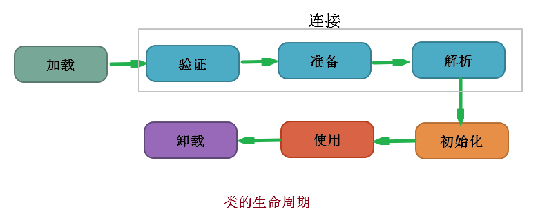

# 类加载

## 类加载器深入解析与阶段分解
    1. 概述
        * 在java代码中，类型的加载、连接与初始化过程都是在程序运行期间完成的。
            * 类型：指我们定义的class，interface，enum等

            * 加载：最常见的情况是指将已经存在字节码文件从硬盘加载到内存

            * 连接：将类与类之间的关系进行确立，并且对字节码文件进行处理（如验证、校验）等

        * 提供了更大的灵活性，增加了更多的可能性

    2. 类加载器的剖析
        * Java虚拟机与程序的生命周期

        * 在下面几种情况下，Java虚拟机将结束生命周期
            <1> 执行了System.exit()方法
            
            <2> 程序正常执行结束

            <3> 程序正在执行过程中遇到了异常或错误而异常终止

            <4> 由于操作系统出现错误而导致Java虚拟机进程终止

    3. 类加载的五个过程
        * 加载：查找并加载类的二进制数据

        * 连接：
            <1> 验证：确保被加载类的正确性

            <2> 准备：为类的静态变量分配内存，并将其初始化为默认值
                * 举例：当你定义一个变量时，首先会有一个默认值（这就是在这一步实现的）如：整型的默认值为0等

            <3> 解析：把类中的符号引用转换为直接引用

        * 初始化：为类的静态变量赋予正确的初始值

        * 使用：正常使用

        * 卸载：销毁该类

## 类的加载连接与初始化过程详解
    1. 类的加载流程图



    2. 类的加载连接与初始化过程
        * Java程序对类的使用方式分为两种

            * 主动使用(7种)
                <1> 创建类的实例（创建对象）

                <2> 访问某个类或者接口的静态变量，或者对该静态变量赋值

                <3> 调用类的静态方法

                <4> 反射（如：class.forname("com.test.Test")）

                <5> 初始化一个类的子类

                <6> java虚拟机启动时被标明为启动类的类（JavaTest）可以理解为包含带有main方法的类

                <7> jdk1.7开始提供的动态语言支持：
                        * java.lang.invoke.MethodHandle实例的解析结果REF_getStatic, REF_putStatic,REF_
                          invokeStatic句柄对应的类没有初始化，则初始化

            * 被动使用
                * 除了以上七种情况，其他使用Java类的方式都被看作是对类的被动使用，都不会导致类的初始化

                * 注意：这里只是不会导致类的初始化，但是可能会实现类加载的其他几个过程

        * 所有的Java虚拟机实现必须在每个类或接口被Java程序“首次主动使用”时才初始化它们

        * 对于主动使用与被动使用的实现的举例：

```java
/**
 * 声明一个测试类，用于演示类加载与初始化（主动使用与被动使用）  
 *
 *          结论：对于静态字段来说，只有直接定义了该字段的类才会被初始化
 *               当一个类在初始化时，要求其父类全部都已经初始化完毕了
 */
public class Test1 {
    public static void main(String[] args) {
        System.out.println(child.str);              //子类并没有主动使用，所以没有被初始化
//          输出：
//          父类的静态代码块
//          Hello


        //System.out.println(child.str2);           //属于主动使用的第5中情况
//         输出：
//        父类的静态代码块
//        子类的静态代码块
//        World
    }

}

//声明一个父类
class Parent {
    public static String str = "Hello";

    static {
        System.out.println("父类的静态代码块");
    }
}

//声明一个子类继承了Parent

class child extends Parent{
    public static String str2 = "World";

    static {
        System.out.println("子类的静态代码块");
    }
}
```


    3. 类的加载
        * 类的加载是指将类的字节码文件中的二进制数据读入到内存中，将其放在运行时数据区的方法区内，然后再内存中
          创建一个java.lang.Class对象（规范并未说明Class对象位于哪里，HotSpot虚拟机将其放在了方法区中）用来
          封装类在方法区内的数据结构

        * 加载.class文件的方式
            <1> 从本地系统中自直接加载

            <2> 通过网络下载.class文件

            <3> 从zip,jar等归档文件中加载.class

            <4> 从专有的数据库中提取.class文件

            <5> 将java源文件动态的编译为.class文件


## 常量的本质含义与反编译及助记符详解
    1. JVM参数的三种形式
        <1> -xx:+<option>,开启option选               
        <2> -xx:-<option>,关闭option选项
        <3> -XX:<option>=<value>，表示将option选项设置为value

        如：--XX:+TraceClassLoading：用于追踪类的加载信息并打印出来


## 助记符

    1. 访问类或接口的静态变量 ：getstatic

    2. 对静态变量进行赋值 ：putstatic

    3. 调用类的静态方法 ：invokestatic

    4. 将int，float，String类型的常量值从常量池中推送至栈顶：ldc

    5. 将单字节(-128 ~ 127)的常量值推送至栈顶：bipush

    6. 表示将一个短整型常量值（-2 ^ 15 ~ 2 ^ 15）推送至栈顶：sipush

    7. 表示将int类型的1推送至栈顶：iconst_1     (只有iconst_1 ~ iconst_5)注意0与-1也是可以的

    8. anewarray：表示创建一个引用类型的（如类、接口、数组）数组，并将其引用值压入栈顶

    9. newarray：表示创建一个基本数据类型的（如int，byte，short等）数组，并将其引用值压入栈顶


