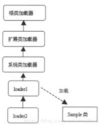
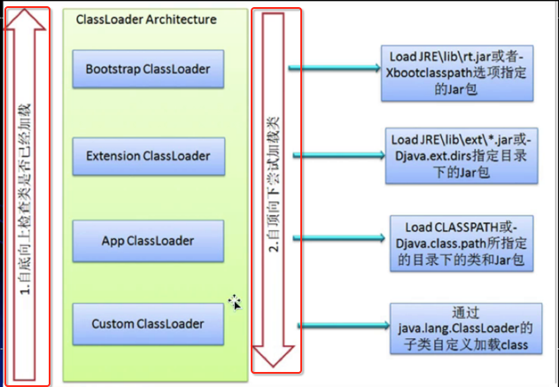

# 类加载器

## 类加载器双亲（父亲）委托机制详解
    1. 类加载器的双亲委托机制
        * 在父亲委托机制中，各个加载器按照父子关系形成了树形结构，除了根加载器之外其余的类加载器都有且只
          一个父加载器


        
        * 描述：
            * 在加载一个类时，首先查看自定义类加载器（loader1），然后会向上传递，依次为系统类加载器，扩展
              类加载器，根加载器，由于根加载器不能加载成功，又会传回给扩展类加载器，而扩展类加载器也加载失
              败，然后会传回给系统加载器（成功），此时直接返回到loader1，整个加载过程完成
            
            * 简而言之，就是加载时首先看有无父加载器，有则上传，直到最高级，然后依次向下看能否加载成功，若
              加载成功则返回到自定义加载器，完成加载



    2. 加载器
        * BootStrap ClassLoader/启动类加载器
            * $JAVA_HOME中jre/lib/rt.jar里面所有的class，由c++实现，不是ClassLoader的子类

        * Extension ClassLoader/扩展类加载器
            * 负责加载java平台中扩展功能的一些jar包，包括$JAVA_HOME中jre/lib/*.jar或-Djava.ext.dirs指定
              目录下的jar包

        * App ClassLoader/系统类加载器
            * 负责加载classpath中指定的jar包及目录中从class

    3. 若有一个类加载器能够成功加载Test类，那么这个类加载器被称为定义类加载器，所有能够返回Class对象引用的
       类加载器（包括定义类加载器）都被称为初始类加载器


## 不同类加载器作用与加载驱动分析
    1. 获取ClassLoader的方法
        * 获取当前类的ClassLoader：clazz.getClassLoader();

        * 获取当前线程上下文的ClassLoader：Thread.currentThread().getContextClassLoader();

        * 获取系统的ClassLoader：ClassLoader.getSystemClassLoader();

        * 获取调用者的ClassLoader：DriverManager.getCallerClassLoader();

## ClassLoader的原码分析
    1. 注意：详细解析我们可以根据jdk的文档API来了解ClassLoader

    2. 要点：
        * 数组类的 Class 对象不是由类加载器创建的，而是由 Java 运行时根据需要自动创建。数组类的类加载器由Class
          .getClassLoader() 返回，该加载器与其元素类型的类加载器是相同的；如果该元素类型是基本类型，则该数组类
          没有类加载器

## 自定类加载器深入详解（原码分析）
    1. 要点：
        * 有些类可能并非源自一个文件；它们可能源自其他来源（如网络），也可能是由应用程序构造的。defineClass方法
          将一个 byte 数组转换为 Class 类的实例。这种新定义的类的实例可以使用 Class.newInstance 来创建。

            * 应用程序可以创建一个网络类加载器，从服务器中下载类文件。示例代码如下所示： 
              ClassLoader loader = new NetworkClassLoader(host, port);
              Object main = loader.loadClass("Main", true).newInstance();

            * 网络类加载器子类必须定义方法 findClass 和 loadClassData，以实现从网络加载类。下载组成该类的字节后，
              它应该使用方法 defineClass 来创建类实例。代码示例如下：

```java
class NetworkClassLoader extends ClassLoader {
         String host;
         int port;

         public Class findClass(String name) {
             byte[] b = loadClassData(name);
             return defineClass(name, b, 0, b.length);
         }

         private byte[] loadClassData(String name) {
             // load the class data from the connection
         }
     }

```
    2. 自定义类加载器（参考本节Test10）


## 类加载器重要方法详解
    1. defineClass方法（查看API详解）
        * 功能：将我们获取的Class文件的数据转换为真正的Class文件。将一个 byte 数组转换为 Class 类的实例。如果该
                域为 null，则将默认域分配给 defineClass(String, byte[], int, int) 的文档中指定的类。这个类必
                须分析后才能使用

    2. findClass方法（查看API详解）
        * 功能：使用指定的二进制名称查找类。此方法应该被类加载器的实现重写，该实现按照委托模型来加载类。

    3.loadClass方法（查看API详解）
        * 功能：使用指定的二进制名称来加载类。此方法使用与 loadClass(String, boolean) 方法相同的方式搜索类
      
        * 此方法的默认实现将按以下顺序搜索类： 

            <1> 调用 findLoadedClass(String) 来检查是否已经加载类。

            <2> 在父类加载器上调用 loadClass 方法。如果父类加载器为 null，则使用虚拟机的内置类加载器。 

            <3> 调用 findClass(String) 方法查找类


## 类加载器双亲委托机制实例深度分析
    1. 详细内容请结合代码部分（Test10_1）

## 类的命名空间与卸载
    1. 详细内容参考代码部分（Test10_2）

    2. 命名空间
        * 每个类加载器都有自己的命名空间，命名空间由该加载器及所有父加载器所加载的类组成

        * 在同一个命名空间中，不会出现类的完整名字（包括类的包名）相同的两个类

        * 在不同的命名空间中，有可能会出现类的完整名字（包括类的包名）相同的两个类

    3. 类的卸载
        * 当MySample类被加载、连接和初始化后，它的生命周期就开始了。当代表MySamople类的Class对象不再被引用，即
          不可触及时，Class对象就会结束生命周期，MySample类在方法区内的数据也会被卸载，从而结束Sample类的生命
          周期

        * 一个类何时结束生命周期，取决于代表它的Class对象何时结束生命周期

        * 由虚拟机自带的类加载器所加载的类，在虚拟机的生命周期中，始终不会被卸载。java虚拟机自带的类加载器包括
          根类加载器、扩展类加载器和系统类加载器，jav虚拟机始终会引用这些类加载器，而这些类加载器则会始终引用
          它们所加载的类的class对象，因此这些class对象始终是可触及的

        * 由用户自定义的类加载器所加载的类是可以卸载的

    4. 类的卸载代码演示参考 Test10_3

## 自定义类加载器在复杂类加载情况下运行分析
    1. 详细请参考代码部分(Test11)

## 类加载器命名空间实战剖析与透彻理解
    1. 参考代码部分（Test11_1）

    2. 关于命名空间的重要说明
        * 子加载器所加载的类能够访问到父加载器所加载的类，父加载器所加载的类无法访问到子加载器所加载的类

## 类加载器实战剖析与疑难点解析
    1. 分析双亲委托机制中，各个类加载器加载的路径
        * 根类加载器：sun.boot.class.path
        
        * 扩展类加载器：java.ext.dirs

        * 系统类加载器：java.class.path
    
    2. 演示通过根类加载器进行加载：将需要访问.class文件放在根类加载器访问的目录下即可（详细见代码Test12_1）

## 类加载器命名空间深度解析与实例分析
    1. 代码参考Test14、Test15

    2. 不同类加载器的命名空间的关系
        * 同一个命名空间的类是相互可见的

        * 子加载器的命名空间包含所有父加载器的命名空间。子加载器所加载的类能够访问到父加载器所加载的类，父加载器所
          加载的类无法访问到子加载器所加载的类。例如：系统类加载器所加载的类能够看见根类加载器所加载的类

        * 如果两个加载器之间没有直接或者间接父子关系，那么它们各自加载的类相互不可见
    
## 类加载器命名空间总结与扩展类加载器要点分析
    1. 类加载器的双亲委托模型得好处
        <1> 可以确保java核心类库的安全
            * 所有的java应用都至少会引用java.lang.Object类，也就是说，在运行期，java.lang.Object这个类会被加载到
              java虚拟机中，如果这个加载过程是由java应用自己的类加载器（自定义类加载器）所完成的，那么可能就会在JVM
              中存在多个版本的java.lang.Object类，而这些类之间还是不兼容的，相互不可见的（正是命名空间在发挥作用）

            * 借助用于双亲委托模型，java核心类库中的类加载工作都是由启动类加载器同一完成的。从而确保了java应用所使用
              的都是同一个版本的Java核心类库，它们之间是相互兼容的
              
        <2> 可以确保java核心类库所提供的类不会被自定义的类所替代

        <3> 不同的类加载器可以为相同名称（binary name）的类创建二外的命名空间。
            * 相同名称的类可以并存在java虚拟机中，只需要用不同的类加载器来加载它们即可。不同的类加载器所加载的类之间
              是不兼容的，这就相当于在java虚拟机的内部创建了一个又一个相互隔离的java类空间，这类技术在很多框架中都得
              到了应用

    2. 扩展类加载器特点（代码Test16）
        * 在指定了扩展类加载器的加载目录后，需要将Test16.class文件打包成jar文件之后才能够通过扩展类加载器加载到该文件

## 平台特定的启动类加载器深入分析与自定义系统类加载器详解
    1. 对于命名空间的补充
        * 在运行期，一个java类是由该类的完全限定名（binary name 二进制名称）和用于加载该类的定义类加载器（defining
          loader）所共同决定的。如果同样的名字（相同的完全限定名）的类由两个不同的加载器加载，那么这些类就是不同的，
          即便.class文件的字节码完全一样，并且相同位置加载也是如此

    2. 平台特定的启动类加载器详解（参考代码部分Test17）
        * 内建于JVM中的启动类加载器，会加载java.lang.ClassLoader以及其它的java平台类，当jvm启动的时候，一块特殊的
          机器码会运行，它会加载扩展类加载器和系统类加载器，这块特殊的机器码叫做启动类加载器（bootStrap）

        * 启动类加载器并不是java类，而其他的加载器都是java类，启动类加载器是特定于平台的机器指令，它负责开启整个加载
          过程
        
        * 所有类加载器（除了启动类加载器）都被实现为java类。不过总归要一个组件来加载第一个java类加载器，从而让整个加
          载过程能够顺利的进行下去，加载第一个纯java类加载器就是启动类加载器的职责

        * 启动类加载器还会负责加载供JRE正常运行所需要的基本组件，这包括java.util和java.lang包中的类等等

    
    


          
