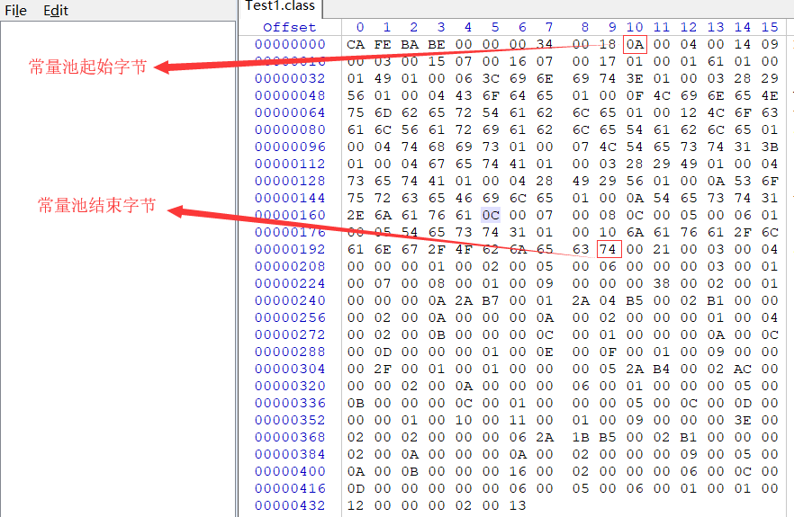
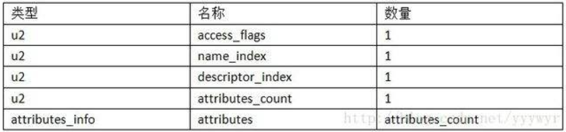
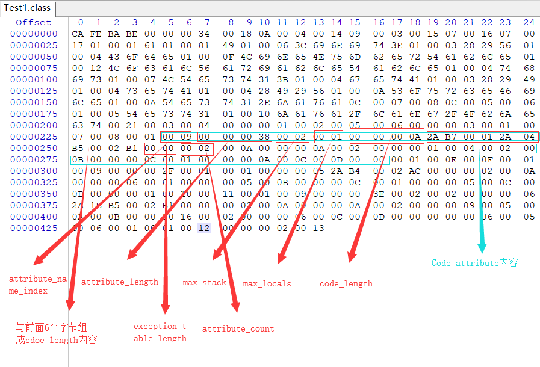
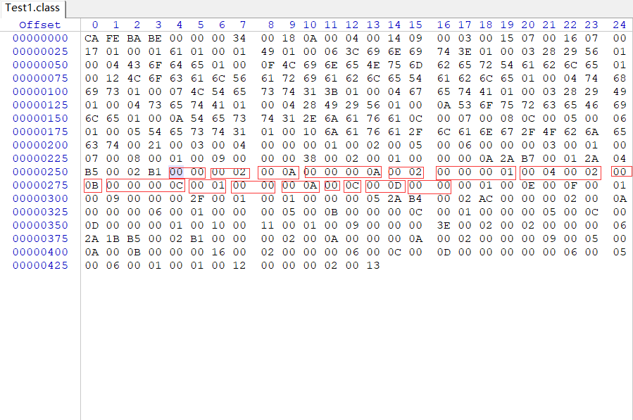

# 字节码

## 字节码文件结构解析
    1. 相关编译命令
        * javap ：反编译字节码文件

        * javap -c ：显示更加详细的字节码内容（并不能够直接看到真正的原始的字节码内容---二进制内容）

        * 通过WinHex可以查看字节码的类二进制表现形式 

    2. 字节码相关的概述
        * 使用javap -verbose命令分析一个字节码文件时，将会分析该字节码文件的魔数、版本号、常量池、类信息、类的构造
          方法信息、类中的方法信息、类变量与成员变量等信息

        * 魔数：所有的.class字节码文件的前四个字节都是魔数，魔数值为固定值：0xCAFEBABE

## 字节码常量池深入剖析
    1. 字节码文件的结构
        我们在代码部分定义的Test1的字节码结构如下图所示

        <1> 最初四个字节都是魔数;魔数后面的四个字节代表版本号，其中前两个字节代表次版本号（minor version）后面两个
            字节代表主版本号（major version）根据上图，我们知道这里的版本号为00 00 00 34，我们将其换算成十进制，
            表示次版本号为0，主版本号为52，所以该文件的版本号为1.8.0。我们可以通过java -version来进行验证

        <2> 常量池(constant pool)：紧接着主版本号之后就是常量池入口。一个java类中定义的很多信息都是由常量池进行维护
            和描述的，可以将常量池看作是Class文件的资源仓库，比如说java中定义的方法和变量信息，都是存储在常量池中的。
            常量池主要存储两类常量：字面量与符号引用。其中字面量如：文本字符串，java中声明为final的常量值等。而符号引
            用如：类和接口的完全限定名，字段的名称和描述符，方法的名称和描述符等

                * 注意：java中常量池不能够简单的理解为只能存储常量，它也能够存储方法名等等

        <3> 常量池的总体结构：java类所对应的常量池主要由常量池数量与常量池数组（常量表）这两部分共同组成。常量池数量
            紧跟在主版本号之后，占据两个字节，常量池数组则紧跟在常量池数量之后。常量池数组与一般的数组不同的是，常量
            池数组中不同的元素类型、结构都是不同的，长度当然也就不同；但是每一种元素的第一个数据都是u1类型，该字节是个
            标志位，占据1个字节。jvm在解析常量池时，会根据这个u1类型来获取元素的具体类型。

                * 注意：常量池中元素的个数 = 常量池数 - 1（其中0暂时不使用），目的是满足某些常量池索引值的数据在特定
                        情况下需要表达『不引用任何一个常量池』的含义；根本原因在于索引0也是一个常量（保留常量），只不
                        过它不位于常量表中，这个常量就对应null值，所以常量池的索引从1而非从0开始

                * 根据上诉分析，我们可以得出Test1.class中常量数为24 - 1 = 23个

    2. 数据类型结构表（11种）

## 透彻分析常量池常量结构与描述符
    1. 继上一节中对字节码文件结构的分析
        <1> 在JVM规范中，每个变量、字段都有描述信息，描述信息的主要作用是描述字段的数据类型、方法的参数列表(包括数量、
            类型与顺序) 与返回值。根据描述符规则，基本数据类型和代表无返回值的void类型都是通过一个大写字母来表示的，对
            象类型则使用大写字母L加对象的完全限定名（通过/来分割）来表示。为了压缩字节码文件的体积，对于基本数据类型，
            JVM都只使用一个大写字母来表示。如下所示：
                B ---> byte
                C ---> char
                D ---> double
                F ---> float
                I ---> int
                J ---> long
                S ---> short
                Z ---> boolean
                V ---> void
                L ---> 对象类型

            例如：Ljava/lang/String:表示字符串对象

            注意：<init>:代表构造方法

        <2> 对于数组类型来说，每一个维度使用一个前置的[来表示，如int[]被记录为[I，String[][]被记录为[[Ljava/lang/
            String

        <3> 用描述符描述方法时，按照先参数列表，后返回值的顺序来描述。参数列表按照参数的严格顺序放在一组()之中。
            如方法：
                String getRealName(int id, String name)的描述符为：(I, Ljava/lang/String;)Ljava/lang/String;

    2. 字节码文件结构总结
        * 对Test1.class字节数据的分析：
            * 最初的4个字节为魔数，魔数后的2个字节为次版本号，次版本号之后的2个字节为主版本号，主版本号后是常量池入口
             （主版本号之后的2个字节为常量池的数量，再之后就是常量池数组）
            
            * 查看字节码文件可知，第一组数据（第一个u1）为0A，这就代表u1值为10，接着参考数据结构表可知，当值为10时，
              那么对应的类型就是Methodre，查数据结构表发现，它有两个索引，一个类描述符索引和一个类
              型描述符。类描述符索引项u2（对应着2个字节），那么u2就对应着00 04，也就是说，类描述符索引为4，而类型描述
              符则对应着00 14 ，也就是说类型描述符索引为20，对照下图（反编译表）可知，对应的内容为 java/lang/Object
              与 "<init>":()V（20对应着7和8）。也就是说， Methodref完整的对应着java/lang/Object."<init>":()V

            * 接着就是第二个常量：也就是09，在数据结构表中对应着Fieldref，它的两个索引各对应着是2个字节，即00 03（表示
              类的索引） 与 00 15（属性本身的索引）。这就对应着下表中的3与21，最终即为 Test1.a:I

            * 第三个常量：第三个常量为07 ，在数据结构表中对应着Class_info,它只有一个索引占2个字节，即00 16，也就对应着
              十进制的22，参考下表，最终结果为Test1

            * 第四个常量：第四个常量为07，在数据结构表中对应着Fieldref，它只有一个索引各对应着是2个字节，即00 17，也就对
              应着十进制的23，参考下表，最终结果为java/lang/Object

            * 第五个常量：第五个常量为01，在数据结构表中对应着utf8_info，它的第一个u2为字符串对应的长度，占2个字节，为
              00 01。它的第二个u1为对应长度的utf8字符串，根据长度1,我们需要向后数1个字节即可获取字符串。也就是61，对应
              的十进制是97，对应的ASCII值为a，即a为最终值

            * 第六个常量：第六个常量为01，在数据结构表中对应着utf8_info，它的第一个u2为字符串对应的长度，占2个字节，为
              00 01。它的第二个u1为对应长度的utf8字符串，根据长度1,我们需要向后数1个字节即可获取字符串。也就是49，对应的
              十进制是73，对应的ASCII值为I

            * 第七个常量：第七个常量为01，在数据结构表中对应着utf8_info，它的第一个u2为字符串对应的长度，占2个字节，为
              00 06。它的第二个u1为对应长度的utf8字符串，根据长度6，我们需要向后数6个字节即可获取字符串。也就是3C 69 
              6E 69 74 3E，对应的ASCII值为<init>

            ......

            * 分析起始值为0C的常量（前面起始值为1的常量省略），局部图片如下。

            * 自常量池入口第10个字节开始到第202个字节74结束，都是常量池内容。如图：
        

## 字节码整体结构
    1. java字节码整体结构分析图

## 字节码访问标志与字段表详解
    1. 数据结构描述表

    2. 完整的Java字节码结构

    3. Class字节码中有两种数据类型
        * 字节数据直接量：这是基本的数据类型。共细分为u1、u2、u4、u8四种，分别代表连续的1个字节、2个字节、4个字节、8
          个字节组成的整体数据

        * 表(数组)：表是由多个基本数据或其他表，按照既定顺序组成的大的数据集合。表是有结构的，它的结构体现在：组成表的
          成分所在的位置和顺序都是已经严格定义好的（如：常量池表（常量池数组））

    4. 通过之前的数据结构表，我们发现共有11中数据类型的结构。
        * 在JDK1.7之后又增加了三种数据结构，如下所示：
            <1> CONSTANT_MethodHandle_info

            <2> CONSTANT_MethodType_info

            <3> CONSTANT_InvokeDynamic_info
        
        * 在JDK1.7之后有14中数据类型结构

    5. Access_Flag访问标志
        * 访问标志信息包括该Class文件是类还是接口，是否被定义为public，是否是abstract，如果是类，是否被声明为final。
          通过我们声明的Test1的源代码，我们知道该文件是类而且还是publilc修饰的。

        * Access_Flag访问标志表
            * 中文版参考如下

            * 英文版参考如下
            

    
        * 注意：在访问标志符中，如果一个类中有多个标志，那么就利用它们的并集来表示。如：在Test1中的访问标志符为00 21
                这是ACC_PUBLIC(0x0001)与ACC_SUPER(0x0020)的结合

        * 访问标志是在常量池之后的，占2个字节，即0x0021:是0x0001和0x0020的并集，表示ACC_PUBLIC与ACC_SUPER，如下图

    6. 相关字段 
        <1> ThisClassName本类完全限定名

            * 参考java字节码整体结构分析图，在访问标志之后就是当前类的完全限定名，占两个字节，即0x0003，对应的就是常
              量3，3指向常量22，得到结果Test1。如下图

        <2> SuperClassName父类的完全限定名

            * 参考java字节码整体结构分析图，在当前类名之后就是父类的完全限定名，占两个字节，即0x0004，对应的就是常量
              4, 4指向常量23，得到结果java/lang/Object，如下图

        <3> Interfaces接口

            * 参考java字节码整体结构分析图，在父类之后就是接口，接口有两部分组成，首先是2个字节长的接口个数，其次，就
              是接口表（接口数组）。在Test1中，由于没有接口，所以对应的就应该是0x0000，同样接口数组也就是无。如图，

        <4> Field 字段表集合

            * 由于接口数组是无，所以接下来就是Field字段。首先是field的个数，占2个字节，然后是field表（fields_count
              :u2表）。在Test1中，field_count为0x0001，表示有一个字段，接着就是field表的信息，为0x0002，由2个字节
              构成的，表示私有的，接着就是名字索引，占2个字节，为0x0005，对应着a。再接着就是描述符索引，占2个字节，
              为0x0006，对应着I。再接着就是attribute_count，占2个字节，为0x0000，也就是无。如图所示

                  * 另一种表示如下
                      field_info {
                            u2 access_flags;  0002
                            u2 name_index;  0005
                            u2 descripter_index;  0006
                            u2 attribute_count;   0000
                            attribute_info attributes[attributes_count];
                      }

            * 字段表集合
                * 字段表用于描述类和接口中声明的变量。这里的字段包含了类级别变量以及实例变量，但是不包括方法内部声明
                  的局部变量

                * fields_count:u2表

## java字节码方法表与属性表深度剖析
    1. 方法描述Methods
        * 紧接着字段之后的就是method_count（方法数量），占2个字节，在Test1.class中为0x0003，也就是说有3个方法（set，
          get，与无参构造），接着就是方法表的内容（参考method_count u2表）。方法表中首先是access_flags,占2个字节，为
          0x0001，表示是public的，接着就是name_index，占2个字节，为0x0007，对应着<init>,然后是descripter_index,占
          两个字节，为0x0008,对应着()V。接着就是attribute_count，为0x0001,表示有1个属性，然后我们就需要进入到属性表
          （表中只有一个数据），属性表中，首先是attribute_name_index，占2个字节，为0x0009，对应着Code（代表执行代码），
          接着就是attribute_length，占4个字节，为0x00000038，表示会占据56个长度的字节，作为Code的值，最后就是attribu
          te_length，占56个字节，如下图所示

        * 方法的属性结构
            * 方法中的每个属性都是一个attribute_info结构，表示如下：
                attribute_info {
                  u2 attribute_name_index;                        //表示属性名索引
                  u4 attribute_length;                            //表示属性长度
                  u1 attribute_length;                      //具体信息
                }

        * JVM预定义了部分attribute，但是编译器自己也可以实现自己的attribute写入class文件利，供运行时使用。

        * 不同的attribute通过attribute_name_index来区分

        * method_count u2表

    2. Code结构
        <1> Code attribute的作用是保存该方法的结构，如所对应的字节码
            Code_attribute {
              u2 attribute_name_index;
              u4 attribute_length;
              u2 max_stack;
              u2 max_locals;
              u4 code_length;
              u1 code[code_length];
              u2 exception_table_length;
              {
                u2 start_pc;
                u2 end_pc;
                u2 handler_pc;
                u2 catch_type;
              }exception_table[exception_table_length];
              u2 attribute_count;
              attribute_info attributes[attribute_length];
            }

        <2> 相关解释
            * attribute_length表示attribute所包含的字节数，不包含attribute_name_index和attribute_length字段

            * max_satck表示这个方法余晓玲的任何时刻所能到达的操作数栈的最大深度

            * max_locals表示方法执行期间创建局部变量的数目，包含用来表示传入参数的局部变量

            * code_length表示该方法所包含的字节码的字节数以及具体的指令码

            * 具体的字节码即是该方法被调用时，虚拟机所执行的字节码

            * exception_table这里存放的是处理异常的信息

            * 每个exception_table表项由start_pc、end_pc、handler_pc、catch_type组成

            * start_pc和end_pc表示从code数组中的从start_pc和end_pc处（包含start_pc，不包含end_pc）的指令抛出的
              异常会由这个表来处理

            * handle_pc表示处理异常的代码的开始处。catch_type表示会被处理的异常类型，它指向常量池中的一个异常类。
              当catch_type为0时，表示处理所有异常

        <3> 针对Test1.class中Code结构的解析
            * Code是自attribute_name_index，开始的，也就是0x0009

    3. 查看字节码的工具jclasslib
        * 可以访问：https://github.com/ingokegel/jclasslib进行下载

        * 在IDEA中也能下载（IDEA插件）：
            * 直接在Plugins进行搜索即可

    4. 附加属性（属于Code中的附加属性）
        * LineNumberTable：这个属性用来表示code数组中字节码和java代码行数之间的关系，这个属性可以用来在调试的时候
          定位代码执行的行数

        * LineNumberTable_atribute {
              u2 attribute_name_index;
              u4 attribute_length;
              u2 line_number_table_length;
              { u2 satrt_pc;
                u2 line_number;
              } line_number_table[line_number_table_length];
        }

## java字节码方法表结构深度剖析
    1. 方法前面内容以及第一个方法的分析

        * 紧接着字段之后的就是method_count（方法数量），占2个字节，在Test1.class中为0x0003，也就是说有3个方法（set，
          get，与无参构造），接着就是方法表的内容（参考method_count u2表）。方法表中首先是access_flags,占2个字节，为
          0x0001，表示是public的，接着就是name_index，占2个字节，为0x0007，对应着<init>,然后是descripter_index,占
          两个字节，为0x0008,对应着()V。接着就是attribute_count，为0x0001,表示有1个属性，然后我们就需要进入到属性表
          （表中只有一个数据），属性表中，首先是attribute_name_index，占2个字节，为0x0009，对应着Code（代表执行代码），
          接着就是attribute_length，占4个字节，为0x00000038，表示会占据56个长度的字节，作为Code的值，最后就是attribu
          te_length，占56个字节，如下图所示

        * 接着就是exception_table_length，占2个字节，由于没有异常所以为0x0000，接下来就是attribute_count，占2个字节
          为0x0002，表示有两个属性，接下来就是LineNumberTable的内容，（第一个属性）首先是attribute_name_index，占
          2个字节，为0x000A，表示常量池中常量10的内容（LineNumberTable），接下来就是attribute_length，占4个字节，
          为0x0000000A，表示长度为10个字节，那么接下来的10个字节都是表示LineNumber的真正信息，即00 02 00 00 00 01 
          00 04 00 02，其中00 02表示有2对映射，00 00 00 01表示字节码偏移量为0,源代码的行号为3，而00 04 00 02表示字
          节码偏移量为4,源代码的行号为2。（第二个属性）首先是LocalVarible_index，占2个字节，为0x000B，表示常量池中
          常量11的内容（LocalVaribleTable），接下来就是attribute_length，占4个字节，为0x0000000C，表示长度为12个字
          节,那么接下来的12个字节都是表示LocalVaribleTable的真正信息，即00 01 00 00 00 0A 00 0C 00 0D 00 00，其中
          00 01表示局部变量个数，为1，之后2个字节表示局部变量开始位置，为 00 00 ，再后面2个字节为局部变量结束位置，为
          00 0A 索引占1个字节，为00， 接下来一个字节表示局部变量对应常量池的位置，为0C，表示12（this），之后两个字节
          是对局部变量的描述，为00 0D，对应着常量池中13（LTest1），再之后2个字节，用于校验检查，为00 00。如下图：

        * 注意：对于java而言，在实例方法（非静态方法）中最少有一个变量this。

## java字节码整体分析与总结
    1. 第二个方法的分析
        * 接着上一节，那么接下来就是第二个方法的内容。首先是access_flags，占2个字节，为0001，表示public的，接着就是
          name_index，占2个字节，为0x000E，表示14（常量池），对应着getA,然后是descripter_index,占两个字节，为0x000F,
          表示15（常量池），对应着()I。接着就是attribute_count，为0x0001,表示有1个属性，然后我们就需要进入到属性表
          （表中只有一个数据），属性表中，首先是attribute_name_index，占2个字节，为0x0009，对应着Code（代表执行代码），
          接着就是attribute_length，占4个字节，为0x0000002F，表示会占据47个长度的字节，作为Code的值，最后就是attribu
          te_length，占47个字节，

        * 接着就是max_stack，占2个字节，为00 01，表示操作数栈最大深度是1，接着就是max_locals，占2个字节，为00 01，表示
          局部变量数量是1，再接着就是code_length，占4个字节，为00 00 00 05，表示之后的5个字节是方法的执行体，即2A B4 00
          02 AC(可以通过jclasslib查看，其中2A代表助记符，B4也代表助记符，00 02代表B4对应的常量池索引，AC代表助记符)，
          接着就是exception_table_length，占2个字节，由于没有异常所以为0x0000，接下来就是attribute_count，占2个字节
          为0x0002，表示有两个属性，接下来就是LineNumberTable的内容，（第一个属性）首先是attribute_name_index，占
          2个字节，为0x000A，表示常量池中常量10的内容（LineNumberTable），接下来就是attribute_length，占4个字节，
          为0x00000006，表示长度为6个字节，那么接下来的6个字节都是表示LineNumber的真正信息，即00 01 00 00 00 05，其中
          00 01表示有1对映射，00 00 00 05表示字节码偏移量为0,源代码的行号为5，（第二个属性）首先是LocalVarible_index，
          占2个字节，为0x000B，表示常量池中常量11的内容（LocalVaribleTable），接下来就是attribute_length，占4个字节，
          为0x0000000C，表示长度为12个字节,那么接下来的12个字节都是表示LocalVaribleTable的真正信息，即00 01 00 00 00
          05 00 0C 00 0D 00 00 ，其中00 01表示局部变量个数，为1，之后2个字节表示局部变量开始位置，为 00 00 ，再后面2
          个字节为局部变量结束位置，为00 05 索引占1个字节，为00， 接下来一个字节表示局部变量对应常量池的位置，为0C，表示
          12（this），之后两个字节是对局部变量的描述，为00 0D，对应着常量池中13（LTest1），再之后2个字节，用于校验检查，
          为00 00。如下图：

    2. 第三个方法的分析
        * 接着上面，那么接下来就是第三个方法的内容。首先是access_flags，占2个字节，为0001，表示public的，接着就是
          name_index，占2个字节，为0x0010，表示10（常量池），对应着setA,然后是descripter_index,占两个字节，为0x0011,
          表示11（常量池），对应着(I)V。接着就是attribute_count，为0x0001,表示有1个属性，然后我们就需要进入到属性表
          （表中只有一个数据），属性表中，首先是attribute_name_index，占2个字节，为0x0009，对应着Code（代表执行代码），
          接着就是attribute_length，占4个字节，为0x0000003E，表示会占据62个长度的字节，作为Code的值，最后就是attribu
          te_length，占62个字节，

        * 接着就是max_stack，占2个字节，为00 02，表示操作数栈最大深度是2，接着就是max_locals，占2个字节，为00 02，表示
          局部变量数量是2，再接着就是code_length，占4个字节，为00 00 00 06，表示之后的6个字节是方法的执行体，即2A 1B B5
          00 02 B1(可以通过jclasslib查看，其中2A代表助记符，1B也代表助记符，B5代表助记符,00 02代表索引，B1代表助记符)，
          接着就是exception_table_length，占2个字节，由于没有异常所以为0x0000，接下来就是attribute_count，占2个字节
          为0x0002，表示有两个属性，接下来就是LineNumberTable的内容，（第一个属性）首先是attribute_name_index，占
          2个字节，为0x000A，表示常量池中常量10的内容（LineNumberTable），接下来就是attribute_length，占4个字节，
          为0x0000000A，表示长度为10个字节，那么接下来的10个字节都是表示LineNumber的真正信息，即00 02 00 00 00 09 00
          05 00 0A，其中00 02表示有2对映射，00 00 00 09表示字节码偏移量为0,源代码的行号为9，00 05 00 0A表示字节码偏移
          量为5,源代码的行号为10（第二个属性）首先是LocalVarible_index，占2个字节，为0x000B，表示常量池中常量11的内容
          （LocalVaribleTable），接下来就是attribute_length，占4个字节，为0x00000016，表示长度为22个字节,那么接下来
          的22个字节都是表示LocalVaribleTable的真正信息，即00 02 00 00 00 06 00 0C 00 0D 00 00 00 00 00 06 00 05
          00 06 00 01，其中00 02表示局部变量个数，为2，之后2个字节表示局部变量开始位置，为00 00，后面长度为00 06，00 
          0C为名字，索引占1个字节，为00，接下来1个字节为描述符，为 0D（对应常量池13），之后2个字节，为00 00用于校验检查，
          下一个偏移量起始位置为00 00，长度为 00 06，索引占两个字节，为00 05，描述符占2个字节为 00 06，最后00 01用于校验
          如下图：

    3. attribute
        * 00 01 表示只有一个attribute属性，名字索引对应00 12，也就是常量池中18，之后4个字节表示长度，为00 00 00 02
          最后2字节就是具体内容，为00 13，查找常量池19（Test1.java）。如图

