# 字节码

## synchronized关键字所生成的字节码文件详解
    1. 当我们将Test2中setX方法的public改为private后，会发现在使用javap -verbode命令反编译后，setX方法在字节码
       文件中消失了。这是为什么呢？这是因为在反编译时，需要为命令加上一个-p参数，才能够显示私有的方法，即java -v
       erbose -p。

    2. 在方法声明上加上synchronized关键字与不加的区别
        * 在字节码文件中只是多了ACC_SYNCHRONIZED这个flags

    3.synchronized关键字
        <1> synchronized修饰实例方法时，就是给当前对象（this）上锁，表现在方法说明之上而非代码中。如图：

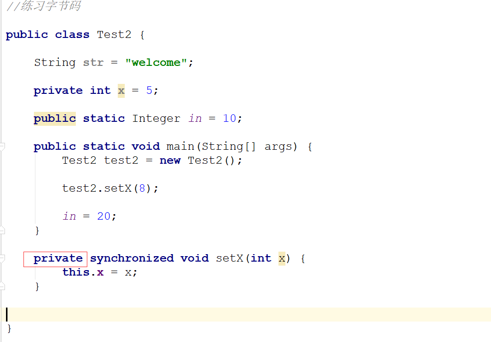

        <2> synchronized修饰方法中的对象时，就会出现moniterenter与moniterexit这一组关键字。

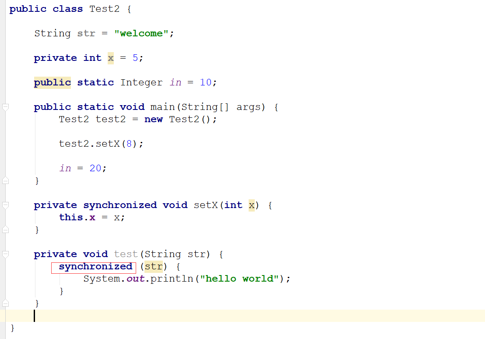
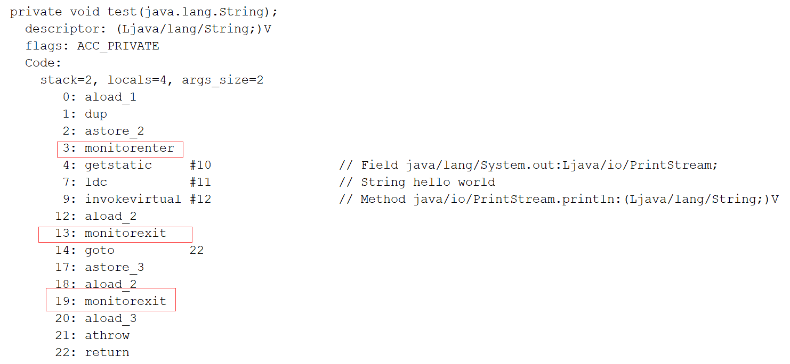

        <3> synchronized修饰静态方法时，同步锁就是锁了整个Class对象。在这里，synchronized修饰的是方法，而非它里
            面的代码，所以在javap中只看到了方法签名上有同步信息。

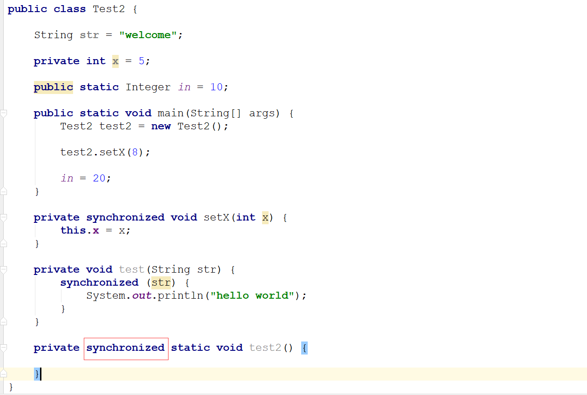
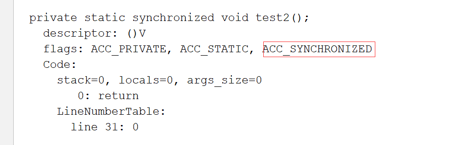

    4. 重入锁与非重入锁
        * 重入锁：就是说同一个线程可以访问多个同步方法
                 
            * 访问一次同步方法其引用计数就加1，像上面的引用计数就会变为2，而当setB()执行完之后，则引用计数就会
              减为1，再setX()执行完则引用计数会减为0

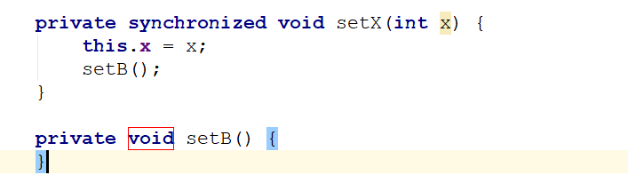

        * 非重入锁：是指多个线程而言的，比如一个线程访问了一个同步方法，另一个线程再访问同一个对象的该方法则会阻塞。

## 复杂字节码文件分析
    1. 本节开始我们将对Test2.class进行深入分析，本节我们首先对前面其他内容以及Test2的常量池中的内容进行分析。

    2. 首先，我们使用javap —verbose 命令获取到Test2的前面的信息以及常量池表的内容，如下图

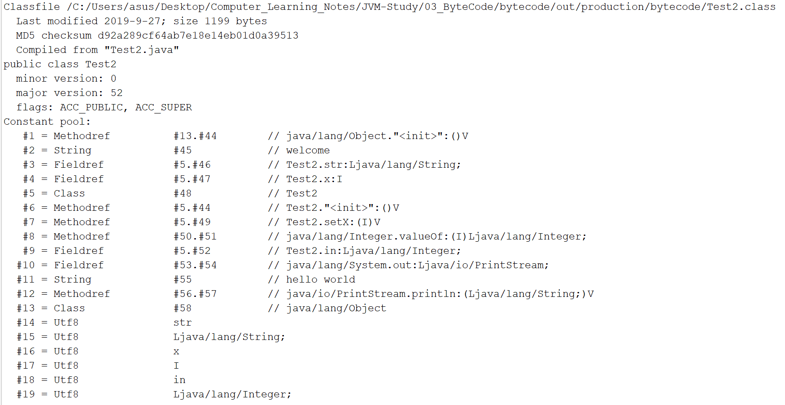

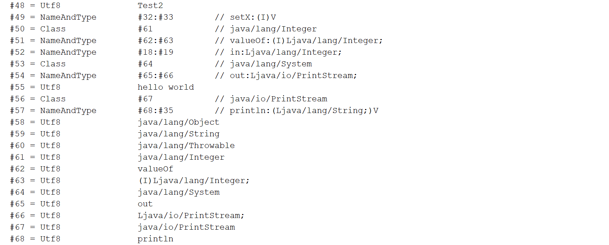

    3. 接下来，我们需要准备编译的原始的字节码文件，如下图

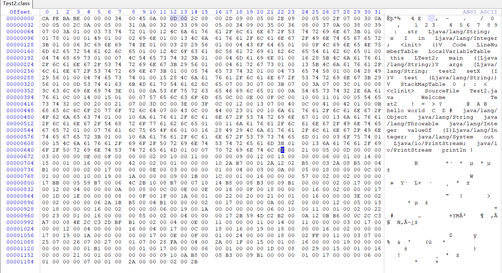

    4. 在做完上述准备之后我们就需要进行分析常量（Constant Pool）
        * 首先前面4个字节是魔数，为CA FE BA BE，接下来的4个字节是次版本号和主版本号，为00 00 00 34，表示jdk1.8.0
          接下来2个字节是表示常量的数量为00  45， 也就是有68个常量（69 - 1）。
          
        <1> 第1个常量
            * 接下来1个字节，表示CONSTANT_Methodref_info，为0A，接下来2个字节为CONSTANT_Methodref_info中CONSTA
              NT_Class_info的描述符索引，为00 0D，表示13,对应常量池中java/lang/Object，接下来的2个字节为CONSTANT
              _ClassAndName_Info的索引，为00 2C，表示44，对应常量池中<init>:()V，所以最终结果就是java/lang/Object 
              "<init>":()V

        <2> 第2个常量
            * 接下来1个字节，表示CONSTANT_String_info，为08，接下来2个字节是指向字符串字面量的索引，为00 2D，表示45
              指向常量池的Welcome

        <3> 第3个常量
            * 接下来1个字节，表示CONSTANT_Fieldref_info,为09，接下来2个字节是指向CONSTANT_class_info的索引项，为
              00 05，表示5，指向常量池的Test2，然后接下来的2个字节，表示字段描述符CONSTANT_NameAndType_info的索引项，
              为00 2E，表示46，指向常量池的str:Ljava/lang/String; 所以常量3的最终结果为Test2.str:Ljava/lang/String;

        <4> 第4个常量
            * 接下来1个字节，表示CONSTANT_Fieldref_info，为09，接下来的2个字节是指向CONSTANT_class_info的索引项，为
               00 05，表示5，指向常量池的Test2，然后接下来的2个字节，表示字段描述符CONSTANT_NameAndType_info的索引项，
              为00 2F，表示47，指向常量池的x:I；所以常量3的最终结果为Test2.x:I

        。。。。。。（按照以上方式分析的字节码文件的常量，省略分析描述）

        <5> 根据上述分分析，发现常量一直到下述位置就完成了分析，如下图
    
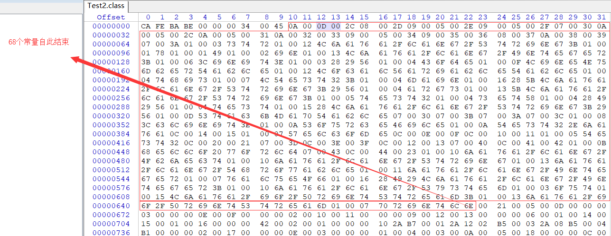

        <6> 常量分析总结：
            * 查看常量需要对照上面提供的11种字节码数据结构类型表，首先需要对照tag，找到对应的内容，接着继续下一步，如果
              遇到索引字节(index)，那么就对照常量池查看对应的常量，如果遇到(length)，就表示长度为length个字节，如果遇
              到bytes，则表示需要找到对应的若干个字节(向后数若干个字节)

## 构造方法和静态代码块字节码指令详解
    1. Access Flags、This Class Name、Super Class Name以及Interfaces的分析
        <1> Access Flags（访问标记）
            * 常量池接下来的2个字节为Access Flags，为00 21，表示为ACC_PUBLIC与ACC_SUPER

            * 注意：查看访问标记，需要查看Access_Flag访问标志表，这里的00 21 是 00 20 与 00 01的结合

        <2> This Class Name（本类名字）
            * 接下来的2个字节表示This Class Name，为00 05 ，对应常量池中索引为5的常量，即Test2

        <3> Super Class Name（父类名字）
            * 接下来的2个字节表示Super Class Name，为00 0D，对应常量池中索引为13的常量，即java/lang/Object

        <4> Interfaces（接口）
            * 接下来2个字节是Interface_count，为00 00，表示没有接口

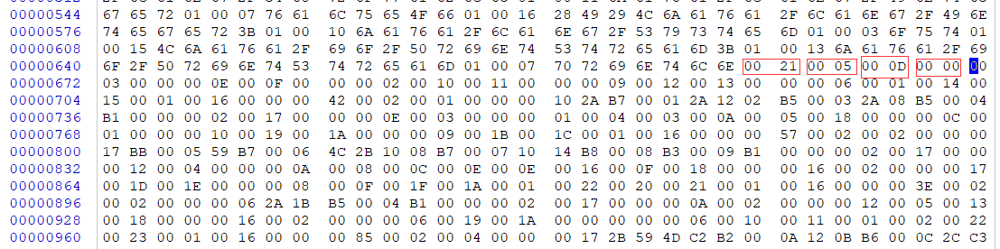

    2. Fields的分析
        * 字段分析参考字段表结构，如下

        <1> Fields_count
            * 接下来2个字节为Filels_count,为00 03，表示在字段表中有3个字段

        <2> 第1个字段
            1. access_flags
                * 接下来2个字节为access_flags，为00 00，表示默认的访问级别（void）

            2. name_index
                * 接下来2个字节为 name_index，为00 0E，对应常量池中索引为14的常量，即str

            3. descripter_index
                * 接下来2个字节为 descripter_index，为00 0F，对应常量池中索引为15的常量，即Ljava/lang/String;

            4. attributes_count
                * 接下来2个字节为 attributes_count，为00 00 ，表示没有属性
        
            5. attribute_info（属性表）
                * 由于没有属性，所以属性表为无

        <3> 第2个字段
            1. access_flags
                * 接下来2个字节为access_flags，为00 02，表示private

            2. name_index
                * 接下来2个字节为 name_index，为00 10，对应常量池中索引为16的常量，即X

            3. descripter_index
                * 接下来2个字节为 descripter_index，为00 11，对应常量池中索引为17的常量，即I

            4. attributes_count
                * 接下来2个字节为 attributes_count，为00 00，表示没有属性
        
            5. attribute_info（属性表）
                * 由于没有属性，所以属性表为无

        <4> 第3个字段
            1. access_flags
                * 接下来2个字节为access_flags，为00 09，表示private

            2. name_index
                * 接下来2个字节为 name_index，为00 12，对应常量池中索引为18的常量，即in

            3. descripter_index
                * 接下来2个字节为 descripter_index，为00 13，对应常量池中索引为19的常量，即Ljava/lang/Integer;

            4. attributes_count
                * 接下来2个字节为 attributes_count，为00 00，表示没有属性
        
            5. attribute_info（属性表）
                * 由于没有属性，所以属性表为无
    
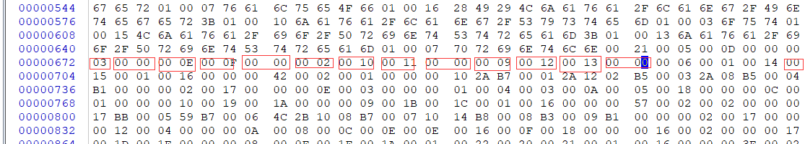        

    3. Method分析
        * 方法分析结构表如下

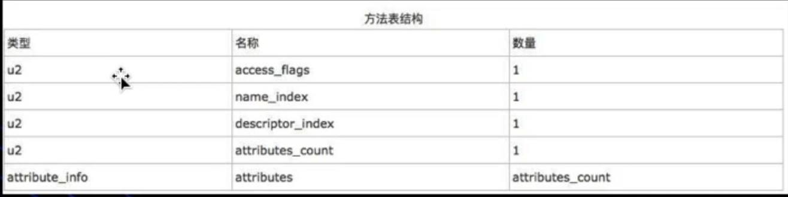

        <1> methods_count
            * 接下来2个字节是 methods_count，表示方法的个数，为00 06，表示总共有6个方法

        <2> 第1个方法
            1. access_flags
                * 接下来2个字节为access_flags，为00 01，表示public

            2. name_index
                * 接下来2个字节为 name_index，为00 14，对应常量池中索引为20的常量，即<init>

            3. descripter_index
                * 接下来2个字节为 descripter_index，为00 15，对应常量池中索引为21的常量，即()V

            4. attributes_count
                * 接下来2个字节为 attributes_count，为00 01，表示有1个属性
        
            5. attribute_info（属性表）
                * 由于有1个属性，所以接下来进入到属性表。表结构如下：

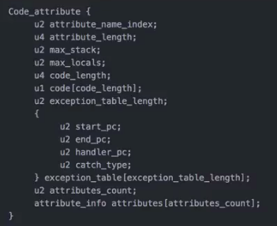

                <1> 首先是attribute_name_index，占2个字节，为00 16，对应着常量池中Code（代表执行代码），接着就是
                    attribute_length，占4个字节，为00 00 00 42，表示会占据66个长度的字节，作为Code的值，需要向后
                    数66个字节表示具体数据，最后就是attribute_length，占2个字节，为，如下图 

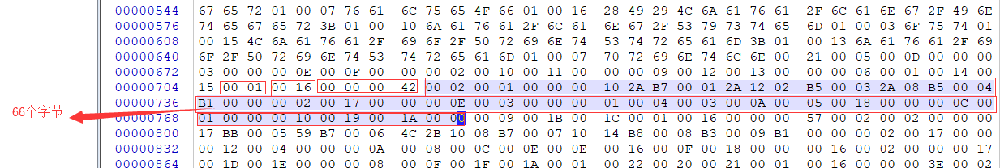

                注意：
                    * 对成员变量的的赋值是通过构造方法实现的，并非在代码开始时就进行赋值（如：int a = 10）

                    * 如果有多个构造方法，那么成员变量的赋值会在每一个构造方法中进行

    4. 构造方法相关内容
        * 如果一个类没有构造方法，编译器会默认生成构造方法，同时将成员变量的赋值放在默认构造方法中，如果自己提供了构
            造方法，编译器在编译完之后依然会将赋值放在自己的构造方法中

    5. monitorenter与nonitorexit
        * monitorenter：
            <1> 功能：表示进入到对象监听器中

            <2> 描述：每一个对象都会与监听器关联，如果拥有监听器则会被上锁，执行了monitorenter，线程会尝试去获取与
                      ObjectRef关联的监听器所有权：
                        * 如果与objectref关联的监听器count为0，那么线程就会进入到监听器并将标识置为1，该线程则为
                          监听器的拥有者

                        * 如果线程已经拥有了objectref关联的监听器，它就会重新进入监听器，并会增加count的值（可重入锁）

                        * 如果另一个线程已经拥有了与objectref相关联的监听器，这个线程将会阻塞，直到count减为0，然后
                          再尝试着获取拥有权
        
        * monitorexit
            <1> 功能：退出了对象监听器

            <2> 描述：
                    * 执行了monitorexit的线程必须是与objectref所引用的实例所关联的监听器的拥有者

                    * 该线程会将Objectref关联监听器的count减1，如果count减为0了，那么该线程就已经退出该监听器并且不再
                      是 该监听的拥有者，其他线程就可以被允许尝试着执行monitorenter这个操作

    6. 静态变量的赋值操作都会在cl<init>方法中进行
