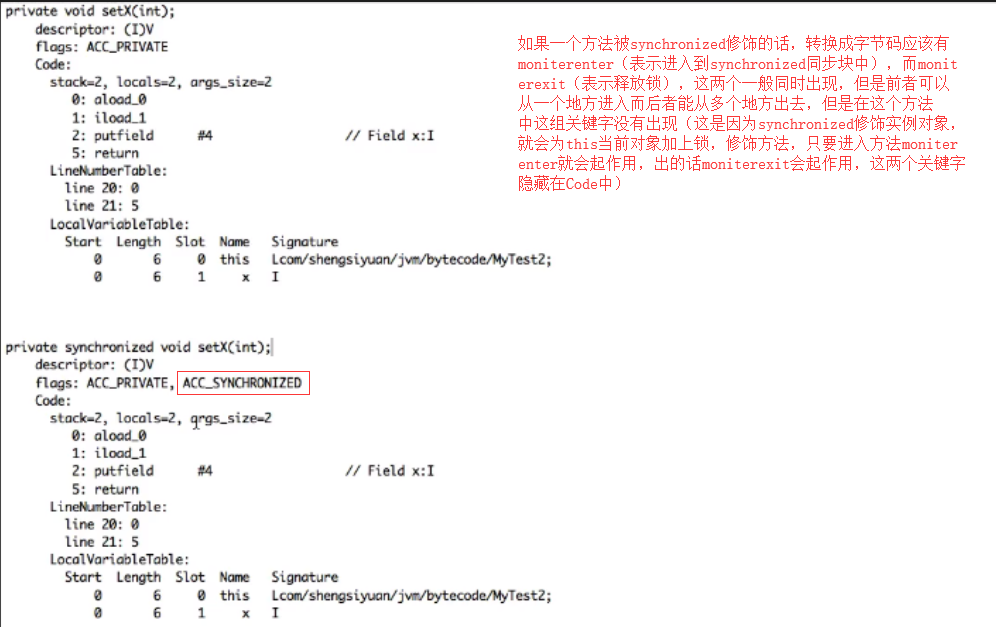
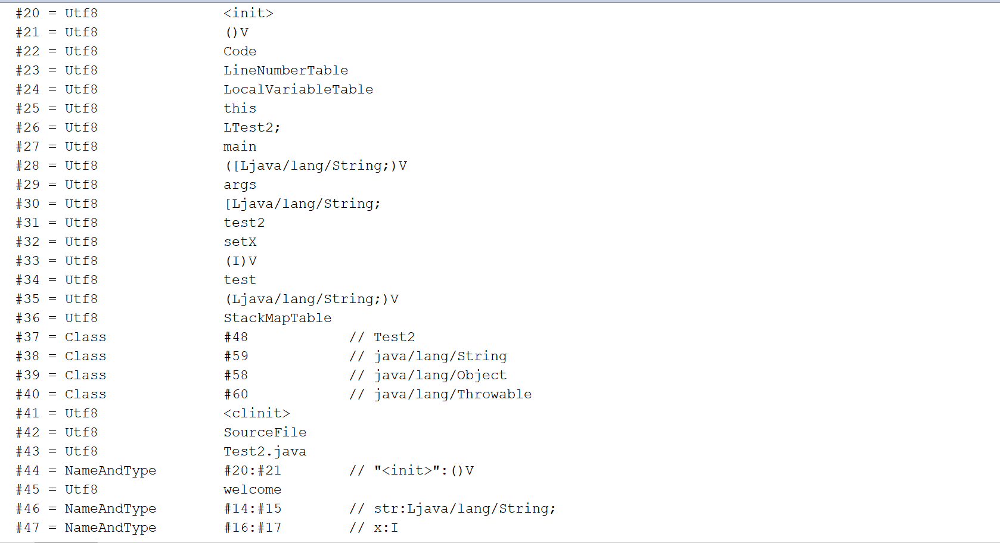

# 字节码

## synchronized关键字所生成的字节码文件详解
    1. 当我们将Test2中setX方法的public改为private后，会发现在使用javap -verbode命令反编译后，setX方法在字节码
       文件中消失了。这是为什么呢？这是因为在反编译时，需要为命令加上一个-p参数，才能够显示私有的方法，即java -v
       erbose -p。

    2. 在方法声明上加上synchronized关键字与不加的区别
        * 在字节码文件中只是多了ACC_SYNCHRONIZED这个flags



    3.synchronized关键字
        <1> synchronized修饰实例方法时，就是给当前对象（this）上锁，表现在方法说明之上而非代码中。如图：


        <2> synchronized修饰方法中的对象时，就会出现moniterenter与moniterexit这一组关键字。


        <3> synchronized修饰静态方法时，同步锁就是锁了整个Class对象。在这里，synchronized修饰的是方法，而非它里
            面的代码，所以在javap中只看到了方法签名上有同步信息。


    4. 重入锁与非重入锁
        * 重入锁：就是说同一个线程可以访问多个同步方法
                 
            * 访问一次同步方法其引用计数就加1，像上面的引用计数就会变为2，而当setB()执行完之后，则引用计数就会
              减为1，再setX()执行完则引用计数会减为0


        * 非重入锁：是指多个线程而言的，比如一个线程访问了一个同步方法，另一个线程再访问同一个对象的该方法则会阻塞。


## 复杂字节码文件分析
    1. 本节开始我们将对Test2.class进行深入分析，本节我们首先对前面其他内容以及Test2的常量池中的内容进行分析。

    2. 首先，我们使用javap —verbose 命令获取到Test2的前面的信息以及常量池表的内容，如下图





    3. 接下来，我们需要准备编译的原始的字节码文件，如下图


    4. 在做完上述准备之后我们就需要进行分析常量（Constant Pool）
        * 首先前面4个字节是魔数，为CA FE BA BE，接下来的4个字节是次版本号和主版本号，为00 00 00 34，表示jdk1.8.0
          接下来2个字节是表示常量的数量为00  45， 也就是有68个常量（69 - 1）。
          
        <1> 第1个常量
            * 接下来1个字节，表示CONSTANT_Methodref_info，为0A，接下来2个字节为CONSTANT_Methodref_info中CONSTA
              NT_Class_info的描述符索引，为00 0D，表示13,对应常量池中java/lang/Object，接下来的2个字节为CONSTANT
              _ClassAndName_Info的索引，为00 2C，表示44，对应常量池中<init>:()V，所以最终结果就是java/lang/Object 
              "<init>":()V

        <2> 第2个常量
            * 接下来1个字节，表示CONSTANT_String_info，为08，接下来2个字节是指向字符串字面量的索引，为00 2D，表示45
              指向常量池的Welcome

        <3> 第3个常量
            * 接下来1个字节，表示CONSTANT_Fieldref_info,为09，接下来2个字节是指向CONSTANT_class_info的索引项，为
              00 05，表示5，指向常量池的Test2，然后接下来的2个字节，表示字段描述符CONSTANT_NameAndType_info的索引项，
              为00 2E，表示46，指向常量池的str:Ljava/lang/String; 所以常量3的最终结果为Test2.str:Ljava/lang/String;

        <4> 第4个常量
            * 接下来1个字节，表示CONSTANT_Fieldref_info，为09，接下来的2个字节是指向CONSTANT_class_info的索引项，为
               00 05，表示5，指向常量池的Test2，然后接下来的2个字节，表示字段描述符CONSTANT_NameAndType_info的索引项，
              为00 2F，表示47，指向常量池的x:I；所以常量3的最终结果为Test2.x:I

        。。。。。。（按照以上方式分析的字节码文件的常量，省略分析描述）

        <5> 根据上述分分析，发现常量一直到下述位置就完成了分析，如下图
    


        <6> 常量分析总结：
            * 查看常量需要对照上面提供的11种字节码数据结构类型表，首先需要对照tag，找到对应的内容，接着继续下一步，如果
              遇到索引字节(index)，那么就对照常量池查看对应的常量，如果遇到(length)，就表示长度为length个字节，如果遇
              到bytes，则表示需要找到对应的若干个字节(向后数若干个字节)

## 构造方法和静态代码块字节码指令详解
    1. Access Flags、This Class Name、Super Class Name以及Interfaces的分析
        <1> Access Flags（访问标记）
            * 常量池接下来的2个字节为Access Flags，为00 21，表示为ACC_PUBLIC与ACC_SUPER

            * 注意：查看访问标记，需要查看Access_Flag访问标志表，这里的00 21 是 00 20 与 00 01的结合

        <2> This Class Name（本类名字）
            * 接下来的2个字节表示This Class Name，为00 05 ，对应常量池中索引为5的常量，即Test2

        <3> Super Class Name（父类名字）
            * 接下来的2个字节表示Super Class Name，为00 0D，对应常量池中索引为13的常量，即java/lang/Object

        <4> Interfaces（接口）
            * 接下来2个字节是Interface_count，为00 00，表示没有接口


    2. Fields的分析
        * 字段分析参考字段表结构，如下


        <1> Fields_count
            * 接下来2个字节为Filels_count,为00 03，表示在字段表中有3个字段

        <2> 第1个字段
            1. access_flags
                * 接下来2个字节为access_flags，为00 00，表示默认的访问级别（void）

            2. name_index
                * 接下来2个字节为 name_index，为00 0E，对应常量池中索引为14的常量，即str

            3. descripter_index
                * 接下来2个字节为 descripter_index，为00 0F，对应常量池中索引为15的常量，即Ljava/lang/String;

            4. attributes_count
                * 接下来2个字节为 attributes_count，为00 00 ，表示没有属性
        
            5. attribute_info（属性表）
                * 由于没有属性，所以属性表为无

        <3> 第2个字段
            1. access_flags
                * 接下来2个字节为access_flags，为00 02，表示private

            2. name_index
                * 接下来2个字节为 name_index，为00 10，对应常量池中索引为16的常量，即X

            3. descripter_index
                * 接下来2个字节为 descripter_index，为00 11，对应常量池中索引为17的常量，即I

            4. attributes_count
                * 接下来2个字节为 attributes_count，为00 00，表示没有属性
        
            5. attribute_info（属性表）
                * 由于没有属性，所以属性表为无

        <4> 第3个字段
            1. access_flags
                * 接下来2个字节为access_flags，为00 09，表示private

            2. name_index
                * 接下来2个字节为 name_index，为00 12，对应常量池中索引为18的常量，即in

            3. descripter_index
                * 接下来2个字节为 descripter_index，为00 13，对应常量池中索引为19的常量，即Ljava/lang/Integer;

            4. attributes_count
                * 接下来2个字节为 attributes_count，为00 00，表示没有属性
        
            5. attribute_info（属性表）
                * 由于没有属性，所以属性表为无
    
        

    3. Method分析
        * 方法分析结构表如下


        <1> methods_count
            * 接下来2个字节是 methods_count，表示方法的个数，为00 06，表示总共有6个方法

        <2> 第1个方法
            1. access_flags
                * 接下来2个字节为access_flags，为00 01，表示public

            2. name_index
                * 接下来2个字节为 name_index，为00 14，对应常量池中索引为20的常量，即<init>

            3. descripter_index
                * 接下来2个字节为 descripter_index，为00 15，对应常量池中索引为21的常量，即()V

            4. attributes_count
                * 接下来2个字节为 attributes_count，为00 01，表示有1个属性
        
            5. attribute_info（属性表）
                * 由于有1个属性，所以接下来进入到属性表。表结构如下：


                <1> 首先是attribute_name_index，占2个字节，为00 16，对应着常量池中Code（代表执行代码），接着就是
                    attribute_length，占4个字节，为00 00 00 42，表示会占据66个长度的字节，作为Code的值，需要向后
                    数66个字节表示具体数据，最后就是attribute_length，占2个字节，为，如下图 


                注意：
                    * 对成员变量的的赋值是通过构造方法实现的，并非在代码开始时就进行赋值（如：int a = 10）

                    * 如果有多个构造方法，那么成员变量的赋值会在每一个构造方法中进行

    4. 构造方法相关内容
        * 如果一个类没有构造方法，编译器会默认生成构造方法，同时将成员变量的赋值放在默认构造方法中，如果自己提供了构
            造方法，编译器在编译完之后依然会将赋值放在自己的构造方法中

    5. monitorenter与nonitorexit
        * monitorenter：
            <1> 功能：表示进入到对象监听器中

            <2> 描述：每一个对象都会与监听器关联，如果拥有监听器则会被上锁，执行了monitorenter，线程会尝试去获取与
                      ObjectRef关联的监听器所有权：
                        * 如果与objectref关联的监听器count为0，那么线程就会进入到监听器并将标识置为1，该线程则为
                          监听器的拥有者

                        * 如果线程已经拥有了objectref关联的监听器，它就会重新进入监听器，并会增加count的值（可重入锁）

                        * 如果另一个线程已经拥有了与objectref相关联的监听器，这个线程将会阻塞，直到count减为0，然后
                          再尝试着获取拥有权
        
        * monitorexit
            <1> 功能：退出了对象监听器

            <2> 描述：
                    * 执行了monitorexit的线程必须是与objectref所引用的实例所关联的监听器的拥有者

                    * 该线程会将Objectref关联监听器的count减1，如果count减为0了，那么该线程就已经退出该监听器并且不再
                      是 该监听的拥有者，其他线程就可以被允许尝试着执行monitorenter这个操作

    6. 静态变量的赋值操作都会在cl<init>方法中进行

## 通过字节码分析this关键字以及异常表的重要作用
    1. 对Test3中，内容的仔细分析与重要问题


    
    2. Java中实例方法的要点（this关键字）
        * 对于Java中的每一个实例方法（非静态方法），其在编译后所生成的字节码文件当中，方法参数的数量总是会比源代码中方法
          参数的数量多1个（this），它位于方法的第一个参数位置，这样，我们就可以在Java的实例方法中使用this来去访问当前对
          象的属性以及其他方法

        * 这个操作是在编译期完成的，由javac编译器在编译的时候对this的访问转换为对一个普通实例方法参数的访问，接下来在运
          行期间，由JVM在调用实例方法时，自动向实例方法传入该this参数，所以，在实例方法的局部变量表当中，至少会有一个指
          向当前对象的局部变量

## 分析java异常处理机制
    1. 通过try...catch方式分析异常表（Test3）
        <1> 异常表内容如下图所示（通过jclasslib查看字节码）


        <2> 查看上表我们可知，总共有3个异常可以被捕获，通过分析，当出现第1个异常的时候，会跳转到助记符37，当出现第2个异常
            的时候，会跳转到助记符49，当出现第3个异常的时候，会跳转到助记符61。如上图所示

        <3> 值得注意的是，编译器会自动为我们生成一个序号为0的异常，any（表示处理之前所有不能处理的异常）

    2. Java字节码对于异常的处理方式
        <1> 统一采用异常表的方式对异常进行处理

        <2> 在jdk1.4.2之前的版本中，并不是采用异常表的方式对异常进行处理的，而是采用特定的指令方式

        <3> 当一场处理存在finally语句块时，现代化的JVM采取的处理方式是将finally语句块的字节码拼接到每一个catch块后面，
            换句话说，也就是程序中有多少个catch块，就会在每一个catch块后面重复多少个finjally语句块的字节码

    3. 行号表与字节码偏移量之间的关系
        <1> 每一个line number都对应着一个字节码偏移量(Start PC),如下图所示


    4. 通过抛出异常的方式分析异常（Test3）
        <1> 如下图，如果我们在方法声明上抛出异常，那么在Test3方法中会多出一个与Code块并列的Exceptions块，里面包含了我们
            所抛出的异常（按照声明顺序排列）

        <2> 如果抛出一个运行期异常（NullpointException），是否也会在Exceptions中呢?答案是会出现的，这与我们在代码中是不
            一样的。因此我们的得出一个结论：不论是抛出运行期异常还是编译期异常都会出现在该异常表中 


## 栈帧与操作数栈剖析及符号引用与直接引用之间的转换
    1. 栈帧
        <1> 栈帧是一种用于帮助Java虚拟机执行方法调用与方法执行的一种数据结构

        <2> 栈帧本身是一种数据结构，封装了方法的局部变量表、动态链接信息、方法的返回地址以及操作数栈等信息
            * 局部变量表：里面存储了所有的局部变量

            * 动态链接信息：c++在编译期就确定了类与类之间的关系，而java则不一样，在编译期间是不知道类之间的关系的，只有
                           在类加载或真正调用时才能知道类之间的关系，基于此就出现了符号引用与直接引用。
                
            * 方法的返回地址：当一个方法调用目标方法时，最终目标方法会返回方法调用方的位置处，所以需要记录下来方法返回的
                            地址信息

        <3> 如下图所示，方法的调用都是以栈帧的形式存在栈中的。（举例：进行一个简单的3-2运算）

        

    2. 局部变量
        <1> 接下来我们需要探讨一下局部变量的问题
            * 值得注意的是，局部变量在方法声明中，但是在方法声明中的局部变量生命周期不一定就一致。如下代码所示，局部变量
              a与局部变量b，c的生命周期就是不一致的

```java
public class Test {
    public void test() {
        int a = 1;
        a ++;

        if(a < 5) {
            int b = 5;
            boolean c = false;
        }
    }
}

```
        <2> 存储局部变量的最小单位称为slot，比如说有10个局部变量则会有10个slot来进行存储,但是这并非绝对的，一般slot是
            32个字节，对于较短的int，short等类型的变量，一个slot就能存储，但是对于long等一些较长类型的变量，是通过连续
            的若干个slot来进行表示的

        <3> 注意：举例：对于10个局部变量不是一定得要10个slot来存储的，因为slot是可以复用的，我们知道方法体中的局部变量
                  出了方法作用域就会回收，但是方法体里面又是可以N多个更小的作用域的（如上述代码所示）。也就是说b可能复
                  用a的slot

    3. 符号引用与直接引用
        <1> 符号引用：可以理解为一种间接的引用方式，通过符号来表示引用，比如引用类中的方法
            直接引用：直接将方法通过指针的方式指向了目标的对象的内存地址，直接就能够找到对应的类或方法等

        <2> 符号引用与直接引用的转换
            * 有些符号引用会类加载阶段或者第一次使用就转换为直接引用，这称为静态解析

            * 还有一些符号引用则是在每次运行期转换为直接引用，这种转换叫做动态链接（体现出Java的多态性）

                * 动态链接的举例说明：如下伪代码
                    Animal a = new Cat();
                    a.sleep();
                    a = new Dog();
                    a.sleep();
                
                * 分析：在上面伪代码中，我们都清楚，我们具体调用的子类Cat和子类Dog的sleep方法，但是，在字节码文件中，a
                       首先指向的是Animal(父类)的引用

## 方法重载与invokevirtual字节码指令的关系
    1. Test4中演示invokestatic的字节码如下：

  

    2. 静态解析的4种情形
        <1> 静态方法
        <2> 父类方法
        <3> 构造方法
        <4> 私有方法（无法被重写）
       以上4类方法被称为非虚方法，它们是在类加载阶段就可以将符号引用转为直接引用的

    3. Test5中调用相关方法字节码文件如下图

 

## 通过字节码分析Java方法的静态分派与动态分派机制

    1. Test6演示java中方法的动态分派（方法重写），如下图

 

    2. 如上图所示，为什么字节码中显示调用Fruit.test，而在代码中却是apple.test和Orange.test？

        * 我们分析java方法的动态分派，需要涉及到一个重要的概念：方法接收者。也就是指该方法是由谁调用的，而invokevirtual
          字节码指令涉及到多态（方法重写）的查找流程：

            1. 到操作数栈的栈顶去寻找栈顶的元素所指向对象的实际类型

            2. 如果在类型中找到了与常量池中描述符和名称相同的方法，并且相应的访问权限是允许的，那么就会返回目标方法的直接引用
               如果找不到实际类型的方法，则会依次从子类到父类中向上寻找，直到找到为止，如果最后找不到，就会抛出异常 

        * 那么，接下来我们就根据上述分析得出该问题的结果（可参考代码Test6）
            1. 首先，在main方法中，执行Fruit apple = new Apple();时，会到操作数栈顶去找实际类型（有子类向父类去查找），最后
               找到了Apple

            2. 然后会在该类中寻找与常量池中描述符和名称相同的方法，同样的也找到了，所以最后输出了apple

 

    3. 通过比较方法重写与方法重载我们可以得出结论：
        * 方法重载是静态的，是编译期行为，方法重写是动态的，是运行期行为

        * 区分动态分派与静态分派的策略：在代码中查看方法接收者是谁，如果是同一个接收者，那么说明是静态分派，如果是不同的方法接
          收者，那么说明是动态分派。例如：Test5中，调用者都是test5，在test6中调用者是apple和orange


    4. 最终，我们可以得出，在java中，方法的符号引用相同也可以解析成多个不同的直接引用，这是多态的体现。如（Fruit.test指向
       Apple.test，以及Orange.test）

