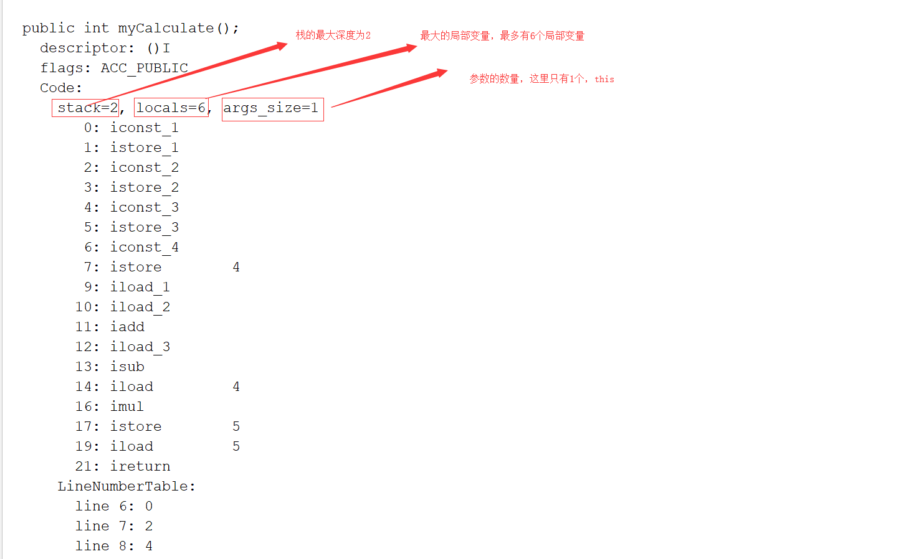
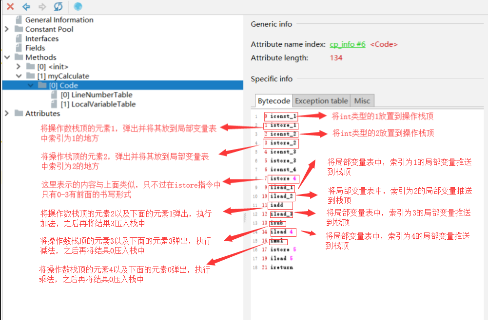
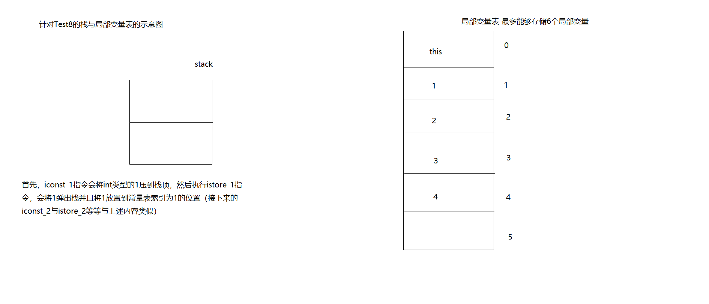

# 字节码

## 虚方法表与动态分派机制讲解
    1. 针对于方法调用的动态分配过程，虚拟机会在类的方法区建立一个虚方法表的数据结构（virtual method table，简称vtable）
       针对于invokeinterface来说虚拟机会建立一个叫做接口方法表的数据结构（interface method table，简称itable）

    2. 如果子类重写了父类的方法，那么父类的方法就会存在子类的虚方法表当中。这也解释了Object类来说里面定义了很多的方法，但
       是实际我们编写的类可能很多都没有重写它里面的方法，那么其虚方法表中都是存在Object当中而非拷贝一份到我们具体子类当中

    3. 在虚方法表中，只要是子类和父类的方法描述符是一样的，那么它们在父类和子类的索引是一样的。这样当查找子类的方法时，由
       于索引跟父类是一模一样的，则直接拿着子类该方法的索引到父类的方法表中的对应的索引就直接可以定位到了，比较高效。一般
       虚方法表都是在类的连接阶段进行的初始化。

    4. 我们定义一个伪代码来描述一个问题：
        public class Parent {
            test1;
            test2;

            public static void main(String[] args) {
                Parent son = new Son();
                son.test3();//这是在编译期就不能通过的
            }
        }

        class Son extends Parent {
            test1;
            test2;
            test3;
        }

        * 那么，为什么在编译期就不能通过呢？
            * 我们通过字节码分析上面代码，首先son的静态类型为Parent，那么在字节码文件中，invokevirtual中，就应该有符号
              引用Parent.test3，但是在Parent中是没有test3的，所以说这是错误的

## 基于栈的指令集与基于寄存器的指令集的对比
    1. 相关概念
        * 现代JVM在执行java代码时，通常会将解释执行与编译执行结合起来进行
            <1> 解释执行：就是通过解释器来读取字节码文件，只要遇到相应的指令就会执行

            <2> 编译执行：就是通过即时编译器（Just In Time, JIT）将字节码转换为本地机器码来执行。

            <3> 现在，JVM会根据代码热点（代码中执行频次比较高的代码），来生成相应的本地机器码，然后执行机器码（由硬件执行，
                效率高）

    2. 基于栈的指令集与基于寄存器的指令集之间的关系
        <1> JVM执行命令时，所采取的方式是基于栈的指令集

        <2> 基于栈的指令集主要有两种操作：入栈和出栈

        <3> 基于栈的指令集的优势在于它可以在不同的平台之间进行移植，而基于寄存器的指令集是与硬件架构紧密连接的，无法做到
            可移植

        <4> 基于栈的指令集的缺点在于，完成相同操作，指令数量通常要比基于寄存器的指令集数量要多，基于栈的指令集是在内存中
            完成的，速度较慢，而基于寄存器的指令集是直接由cpu来执行的，它是高速缓冲区中进行执行的，速度要快很多。虽然虚拟
            机可以采用一些优化手段，但总体来说，基于栈的指令集要慢一些

    3. 举例：2-1
        * 在基于栈的指令集中，首先会将iconst_1与iconst_2压入栈，然后执行isub指令，将iconst_1与iconst_2弹出栈，并进行运算
          并将运算后的结果1压入栈中，最后执行istore_0指令，将结果放在栈中0的位置    

        * 在基于寄存器的指令中，首先，将2放到一个寄存器当中，可能涉及到一个汇编指令：MOV。然后，在同一个寄存器当中调用减法
          指令Sub 1，然后再将结果再放回到寄存器当中。需要2条指令

## JVM执行栈指令集实例剖析
    1. 接下来我们需要着重分析一下Test8的字节码中myCalculate中的栈指令集的内容。首先我们需要准备并清楚一下内容，如图所示

 

 

  

## 通过字节码生成审视Java动态代理运作机制
    1. 实现一个动态代理。（参考代码）

## 动态代理实现机制深层次分析与动态字节码生成总结
    1. 详细内容请参考（引用他人总结的内容）
        https://www.cnblogs.com/webor2006/p/9875053.html

## 字节码部分内容补充
    1. 对于java字节码中的method内容中可不可能没有任何的<init>(构造方法)？
        * 在java字节码method内容中可以不包含着<init>，因为我们不能将JVM规范与java语言规范结合在一起理解，在java语言中，没
          有构造方法，java会自动生成一个构造方法，但是在JVM规范中却不是这样的

    

