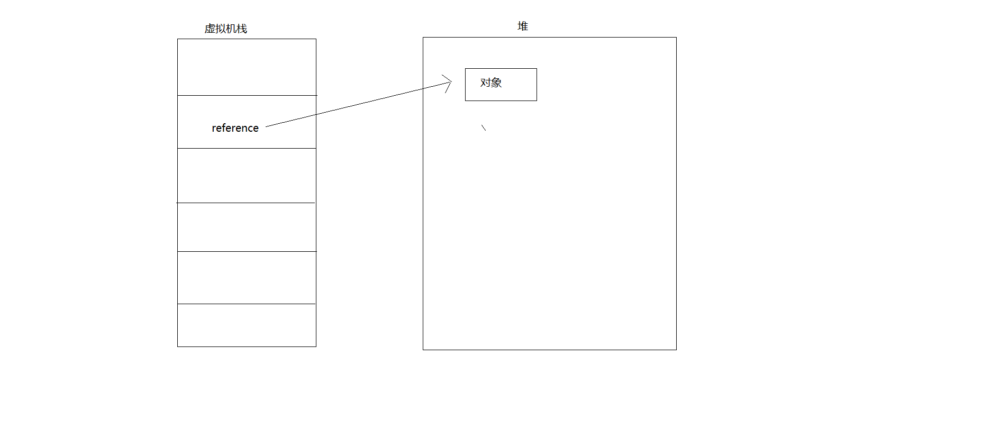
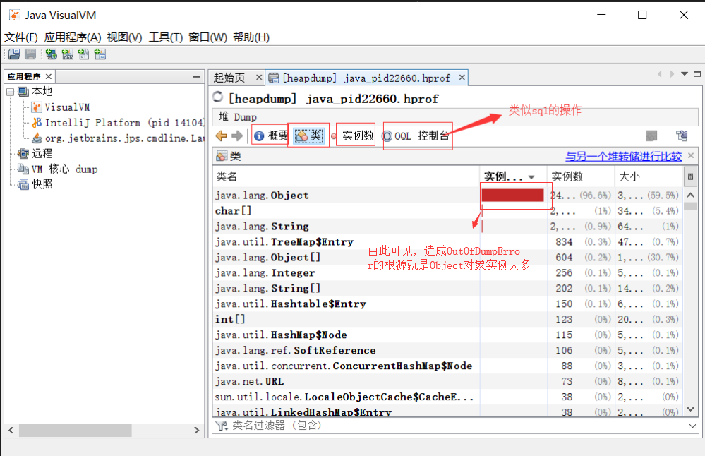
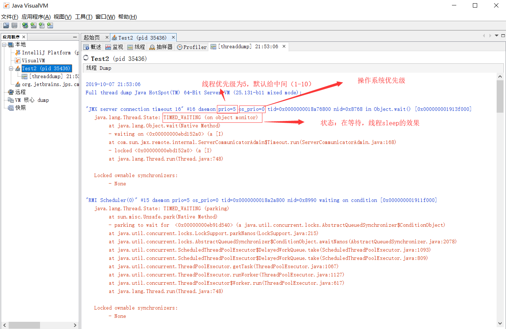

# Memory(与内存相关的内容)

## JVM内存空间划分与作用详解
    1. java内存模型
        <1> 主要包括以下内容：
            * 虚拟机栈：Stack Frame(栈帧)，每一个方法在执行过程中都会生成一个栈帧

            * 程序计数器（Program Counter）：占据空间较小，是用于标识当前线程执行的字节码文件的行号指示器。多线程情况下，
                                            每个线程都具有各自独立的程序计数器，所以该区域是非线程共享的内存区域。当执行
                                            java方法时候，计数器中保存的是字节码文件的行号，即用于描述字节码执行到哪个位
                                            置；当执行Native方法时，计数器的值为空。

            * 本地方法栈：主要用于处理本地方法

            * 堆(heap)：JVM管理的最大的一块内存空间。是线程共享的。在Java当中我们都是通用引用来操作对象的而对象本身是位于堆
                        中，而引用则是位于虚拟机栈中，所以引用本身是个变量，所以在Java中一定是通过引用来获取到这个对象然后
                        去操纵它。如下图

            * 方法区（Method Area）：存储元信息。永久代(Permanent Generation)，从jdk1.8开始，已经彻底废弃了永久代，使用
                                    元空间(meta space)。用于存储已被虚拟机加载的类信息，常量，静态变量，即时编译器编译后
                                    的代码等数据。垃圾收集行为较少。内存回收目标主要是针对常量池的回收和对类型的卸载

            * 运行时常量池：方法区的一部分内容，存放编译期生成的各种字面量（字符串、final变量、类名和方法名）存放符号引用或
                           引用量（类和接口的权限定名、字段的名称和描述符、方法的名称和描述符）字面量和符号引用在类加载后存
                           放到方法区的运行时常量池中。把翻译出来的直接引用也存储在运行时常量池中

            * 直接内存：Direct Memory，由操作系统直接管理，并不是有java直接管理。这与Java NIO密切相关。JVM通过堆上的Direct
                       ByteBuffer来操作直接内存

    2. 引用与对象之间的关系（引用访问对象的方式）
        <1> 引用指向对象的两种形态（如下图）

        <2> 相比之下，第二种可能有一定的优势，比如在有若干的对象，而有些对象已经是垃圾，那么gc需要回收，第一种方式需要将指针
            进行移动，而第二种方式指向的是直接的数据，指针不需要移动

## JVM堆空间用途分析与划分依据（补充拓展）
    1. 虚拟机栈
        * 虚拟机栈本身是归属于特定的线程的，换言之，它是属于线程私有的内存空间。当线程开始运行的时候，与之相关的虚拟机栈就诞生
          了，而当线程消亡时，与之对应的虚拟机栈也就消失了。虚拟机栈里面的数据称为栈帧(Stack Frame)，它主要是用来存储与线程操
          作相关的一些具体数据或者是数据结构（操作数栈、局部变量表，方法的出入口等），里面可以存放基本数据类型，也可以存放引用
          类型（注意：引用类型不是对象），引类型存储在局部变量表中，也就是放在栈帧里面的，也就是属于虚拟机栈。

    2. 程序计数器
        * 属于线程私有的数据结构。在多线程的环境下，在同一时刻肯定只会有一个线程在执行，按照时间片的方式来切换线程。值得思考：
          当一个线程执行到一半的时候核心切到了第二个线程了，势必要记录当前线程要挂起到什么位置上，此信息就是记录在程序计数器上
          的，而每一个程序计数器里面的线程执行的信息其实是线程私有的，也就是说A线程是不能得到B线程的程序计数器的。如果一个程序
          正在执行某一个Java方法，程序计数器记录的就是正在执行字节码对应的地址。

    3. 本地方法栈
        * 有些地方会把本地方法栈与虚拟机栈结合在一起

    4. 堆
        * 用于存储大部分对象，会被每一个线程所共享。与堆相关的一个重要概念就是垃圾收集器，现代几乎所有的垃圾收集器都是采用分代
          收集算法。所以，对应的堆空间也基于这一点进行划分：新生代和老年代。Eden空间，From Survivor空间与To Survivor空间。
          java堆内存的划分在物理内存上既可以是连续的也可以是不连续的

        * 新生代与老年代的划分：
            * 新生代：一般创建一个对象，我们就称为该对象进入新生代。它也是内存的一部分区域

            * 老年代：创建对象之后，后面GC会对内存进行回收，如果GC回收了好几次之后，对象依然存在，那么该对象就会晋升（promote）
                     老年代。老年代就是指该对象在内存中存活较久

        * 老年代的垃圾回收频率比新生代垃圾回收频率要低

        * 注意:并不是新创建的对象一定就是新生代，可以通过参数设置直接让新的对象进入老年代    

    5. 方法区
        * 主要存储元信息（类对象的基本信息，常量的基本信息等），方法区中的信息也是很少被垃圾回收器回收，但是这并不就是永久代（
          一直不被回收）
                     
    6. 总结：
        * 虚拟机栈与程序计数器是线程间所不共享的，堆是线程所共享的

## Java对象内存分配原理与布局
    1. Java对象创建的过程
        * new关键字创建对象的3个步骤：
            <1> 在堆内存中创建出对象的实例
                * 但我们使用new关键字创建对象时，JVM首先会检查new指令的参数是否能在常量池中定位成一个符号引用，之后会检查符号
                  引用对应的内容是否完成了类的加载、连接、初始化（如果没有，就必须完成）然后，JVM就会为对象分配内存（在加载完
                  成之后，就确定了好了分配多少内存），然而对于堆中的内存又分为两部分：一是已经使用的，二是未被使用的。为此，在
                  分配内存时就需要考虑这两种情况。而我们分配使用又有两种方式来调整已经使用和未被使用的内存：
                    
                    <1> 指针碰撞：前提是堆中的空间通过一个指针来进行分割，一侧是已经被占用的空间，一侧是未被占用的空间
                        
                        * 在堆内存中已经截然有序的将已使用和未使用的内存空间给分离开了，比如说左侧是已经占用的空间，而右侧是未
                          被占用的空间。中间可以通过一个指针来指向，这种情况下如果新创建的对象则会存在于未被占用的空间中，然后
                          指针发生了一个移动指向了下一个可以被使用的内存空间

                    <2> 空闲列表：前提是堆内存中已被占用和未被占用的空间相互交织在一起，这时虚拟机就会通过一个列表来记录哪些空间
                                 是未被使用的，哪些空间是已被占用的，接下来找出可以容纳下新创建对象且未被占用的空间，在此空间存
                                 放该对象，同时修改列表上的记录

                * 那么为什么会产生这两种情况呢？
                    * 这是因为垃圾回收算法不同，有的在回收到不连续的垃圾后，有的会将对象进行移动分类（已经占用的为一边，未被占用
                      的为一边），而有的则不会进行对象的移动（导致已被占用和未被占用的空间相互交织在一起）

            <2> 为对象的实例成员变量赋予初值
                * 调用<init>方法完成初始化

            <3> 将对象的引用返回

    2. 对象的内存布局
        <1> 对象头
            * 存放对象自身的一些运行时的数据信息，比如说一个对象有一个hash码、还有分代的一个信息等，把这些信息都放置在对象头里

        <2> 实例数据（我们在类中声明的各种信息）

        <3> 对齐填充（可选） 

    3. 引用访问对象的方式（在上面我们已经进行了描述，参考下图）
        <1> 使用句柄的方式
                * 优点：reference存储的是稳定的句柄地址，在对象被移动时只会改变句柄中的实例数据指针，而reference本身不需要修改

        <2> 使用直接引用的方式
                * 优点：速度更快，它节省了一次指针定位的时间开销。Sun HotSpot使用该访问方式

    4. JVM参数
        -Xms5m：堆空间最小5m
        
        -Xmx5m：堆空间最大5m

        -XX:+HeapDumpOnOutOfMemeryError：获取堆溢出的相关信息（发生内存溢出时来将内存的信息给dump出来）

    5. 当我们加上上述JVM参数运行Test1，得到如下结果

## 实战jvisualvm
    1. jvsualvm介绍：
        * 它是由oracle基于hospot虚拟机力推的一个集大成者的一个功能超级强大的图形化分析工具，它是集成了很多的命令行的工具使得我们
          在一个GUI上看到不管是正在运行的JVM进程的种种信息，包括线程的信息、元空间的信息，堆空间的信息等等

        * 注意：dump出来的文件也叫做“转储”文件

    2. jvisualvm的使用（针对上一节中dump出的文件，Test1）：
        <1> 直接在控制台输入jvisualvm + enter键即可启动

        
        <2> 选择文件 ---> 装入 ---> 选中我们项目中的文件

        <3> 点击相关的参数信息对文件进行分析

        <4> 选中对应的类，右键点击显示实例数，可以显示实例，显示如下

        <5> 查看引用信息

    3. jvisualvm的作用：当程序发生错误时，可以通过jvisualvm来很好的分析程序

    4. 在Test1中显示的调用一下垃圾回收器，然后我们查看jvsualvm的情况
        * 查看CPU与垃圾回收（整体视图）

        
        * 查看堆空间和元空间

        * 查看线程和抽样器

    5. 接下来，我们继续修改，将堆空间从原来的5m减少到2m（在调用gc的情况下），那么会发生什么情况呢？
        
        * 查看上面的图我们知道堆空间维持在4m，那么如果堆空间从5减少到2的话，就会导致堆空间溢出，因为2 < 4,在运行的情况中，满足
          不了运行的需求，所以会导致堆空间溢出

## 线程栈溢出监控与详解
    1. 演示所需要用到的虚拟机参数
        <1> -Xss100k：表示一个栈的大小（为100k）

        * 注意：在JVM虚拟机中栈的大小(size)最小为160K（他人电脑）或108k（自己实验所得），如下

    2.  监视Test2的运行情况（通过线程休眠实现）
        <1> 通过jvisualvm查看属性，在运行程序后，查看jvisualvm，如下图

        <2> 分析详细的线程数据

    3. 第二个工具（jconsole）的使用（也能检测）
        <1> 直接在控制台输入jconsole即可进入，如下

        <2> 查看内存，线程等状况

## 线程死锁检测与分析工作深度解析
    1. 通过jconsole来分析线程死锁问题（Test3）
        <1> 运行程序，打开jconsole观察发现，线程中有Thread-A与Thread-B，但是主线程（main）消亡了。

                * 主线程为什么会消亡：这是因为新建的两个线程相当于主线程的两个子线程在运行，而主线程消亡了

        <2> 对程序进行修改，让主线程休眠4秒，然后观察发现，此时main线程出现了（这是因为主线程在休眠中）

        <3> 观察线程A与B的情况：线程A、B被锁定的class对象是刚好相反，也就是死锁产生的现象。

        <4> 通过点击检测死锁也可以查看死锁信息

    2. 通过jvisualvm来分析线程死锁问题(Test3)
        <1> 运行程序，查看jvisualvm观察如下

        <2> dump出线程的具体信息，观察

    3. 总结补充
        <1> 本地方法栈与虚拟机栈一样都会出现栈溢出的异常，程序计数器JVM规范是不会产生异常的 ，方法区是会产生内存溢出异常
            在元空间中产生异常

        <2> 于JDK1.8开始方法区废除了永久代采用了元空间，而元空间是采用操作系统的本地内存，而且默认情况下它的初始内存大小
            是21MB，并且随着内存的不断占用如果达到了它的上限的话元空间虚拟机会进行垃圾回收，如果回收内存还不够的话就会对
            内存进行扩展，而且这个扩展可以一直扩展到物里内存的最大限度

        <3> 产生元空间溢出需要：
                * 第一步：显示的设置元空间的大小，让元空间不会自动扩展

                * 第二步：通过运行期动态生成类往元空间存放信息，如Java动态代理、cglib库，以实现元空间的溢出

## JVM元空间的深度解析
    1. 在测试元空间时所需要JVM参数
        * -XX:MaxMetaspaceSize=10m  ： 将元空间的大小指定为10m  

    2. 在这里，我们使用cglib的方式创建对象，然后存放在元空间中，设置JVM参数后，运行Test4代码结果如下，发生元空间溢出

    3.接下来我们通过jconsole来进行探测Test4元空间的内容。同时在类视图中勾选<详细输出>后,会在控制台输出类的相关信息

    4. 使用jvsualvm探测Test4。

    5. 查看文章<Java永久代去哪了>了解对应的永久代与元空间的相关信息

        * 要点：
            <1> 可以对-XX:MaxMetaspaceSize进行设置来控制元空间的大小。

            <2> 元空间在64位操作系统的的JVM来说，默认大小为21m。同时如果没有指定元空间大小，元空间会根据内容自动的扩展
                容量

            <3> 元空间：每一个类加载器的存储区域都被称作一个元空间，所有元空间结合在一起就是我们所说的元空间

    