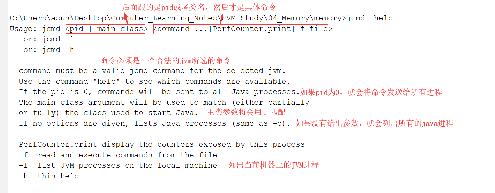
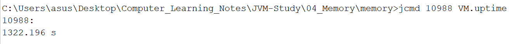
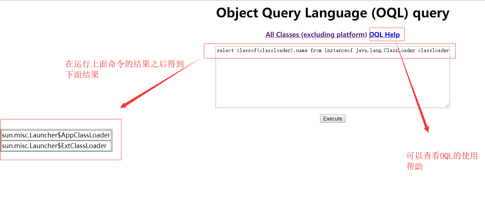

# Memory(与内存相关的内容)

## jmap与jstat工具实战分析
    1. 在之前，我们已经阅读了<java永久代去哪了>，里面也介绍了这两款工具的使用。那么接下来我们就通过实例
       来对这两款工具jmap与jstat进行使用

    2. jmap的使用
        <1> 我们可以直接在控制台输入jmap来获取相关的使用命令以及参数

        <2> 编写程序测试clstats（Test5），首先使用which jmap查看jmap在哪，然后进入到里面，我们可以通过系统命令
            ps -ef | grep java 获取到进程的pid然后进行测试（注意：可以通过jps -v获取pid）

        <3> 测试 heap参数（jmap -heap pid）

    3. jstat的使用
        <1> 直接在控制台输入jstat查看使用方式等信息

        <2> 接下来直接使用，在控制台输入jstat - gc pid即可查看gc参数，如下

        <4> 接下来，观察发现它们没有发生变化，这是因为在Test5中只有输出没有类的信息产生，所以元空间没有占用率增加
            也就是MU没有增加，那么接下来我们查看Test4中(调用了gc)的结果（当运行到元空间大小为200m时，MC与MU就会
            停止变化）

## jcmd命令实战详解                                                       
    1. jps命令：列出当前操作系统中运行的所有java进程以及id值和名字

        * jps -help :查看相关的信息

        * jps -q ：只显示id号

        * jps -mlvV ：所有信息

        * jps -l：会将包名的信息打印出来

    2. jcmd命令：从jdk1.7引入，直接输入jcmd会列出对应的id和名字（参考下图）
        
        * jcmd -l：与jcmd命令一样    
        
        * jcmd -help：查看使用帮助

    3. jcmd详解（利用Test5测试）
        <1> jcmd pid VM.flags:列出当前进程所有的JVM启动参数（参考如下）

        
        <2> jcmd pid help：列出当前运行的java进程可以执行的操作（也就是后面的参数能是哪些）

        <3> jcmd pid help ???(这里可以是任意一个可执行的参数,如：JFR.dump)：查看该执行参数的作用是什么

        <4> jcmd pid PerfCounter.print:查看JVM性能相关的参数

        <5> jcmd pid VM.uptime:查看JVM的启动时长

        <6> jcmd pid GC.class_histogram:查看系统中类的统计信息

        <7> jcmd pid Thread.print:查看线程堆栈信息

        <8> jcmd pid GC.heap_dump filename：导出Heap dump文件，导出的文件可以通过jvisualvm查看

                * 如果在使用时不知道参数有啥，可以使用jcmd pid help GC.heap_dump查看

        <9> jcmd pid VM.system_properties:查看JVM的属性信息

        <10> jcmd pid VM.version:查看魔表JVM进程的版本信息

        <11> jcm pid VM.command_line:查看JVM启动的命令行参数信息

## jmc与jhat工具使用详解
    1. jstack工具的使用
        *jstack是查看或是导出Java应用程序中线程的堆栈信息    

    2. jmc工具的使用
        <1> 相关介绍：集成了许多工具的功能
             * jmc:Java Mission Control
             
             * jfr：Java Flight Recorder（java飞行记录器）

        <2> 查看jmc图形化工具页面

        <3> 使用飞行记录器记录Test5的信息如下

    3. jhat的使用
        <1> jhat：用于查看堆栈信息溢出。使用方式如下
  

        <2> 我们使用jhat访问之前生成堆溢出的文件，情况如下

        <3> 我们查看对应地方的信息如下：（注意：我们可以通过点击链接查看具体的信息）

        <4> 通过观察发现我们可以执行OQL语句的查询（同样也可以在jvsualvm中使用OQL）

        

