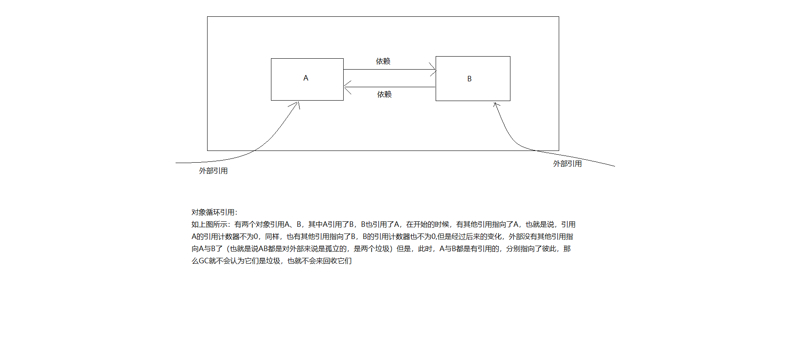

# 垃圾回收机制

## JVM垃圾回收重要理论剖析
    1. JVM运行时内存数据区域


        <1> 图表解析
            * 方法区域线程共享：是指类的class对象的元数据信息映射到方法区中，那么元数据信息就会被所有线程所共享。

            * 堆区域线程共享：是指new出来的对象实例会被所有线程共同访问

            * Java虚拟机栈的线程独享：Java虚拟机栈中存储每个方法的信息（栈帧），每个方法都由线程执行，那么这个方法（栈帧）
                                    肯定是归属于该线程的

            * 本地方法栈与Java虚拟机栈是类似的

            * 程序计数器的独享性：是指由于记录的是执行的指令的序号，那么线程执行的指令也一定是线程独享的

        
        <2> 概念补充
            * JVM虚拟机栈：描述的方式Java方法的执行模型：每个方法执行的时候都会创建一个栈帧，栈用于存放局部变量表，操作栈，
                          动态链接，方法出口等信息一个方法的执行过程就是这个方法对于栈帧的入栈出栈的过程

            * 堆：堆中存放的方式对象的实例，是Java虚拟机管理内存中最大的一块区域，是GC主要的工作区域，为了高效的GC，会把堆
                  细分更多子区域

            * 方法区域：存放了每个Class的结构信息，包括常量池、字段描述、方法描述，是GC的非主要工作区域

        <3> 举例：参考如下代码

```java
public void method1() {
    Object obj = new Object();
}
``` 
            * 代码分析：
                1) 生成了2部分的内存区域：第一部分：obj这个引用变量，因为是方法内的变量，所以放在了java虚拟机栈中。第二部
                   分：真正的Object class的实例对象，存放在堆中

                2) 上述的new语句一共消耗12个字节，JVM规定引用占4个字节(在JVM Stack中)，而控对象是个字节(在Heap中)

                3) 方法结束后，对应Stack中的变量马上回收，但是Heap中的对象需要等到GC来进行回收

    2. JVM垃圾回收(GC)模型
        <1> 垃圾判断算法（判断内存中什么是垃圾什么不是垃圾）

            1) 引用计数算法(Reference Counting)
                * 概念理解：给对象Tian就爱一个引用计数器，当有一个地方引用它，计数器加1，当引用失效，计数器减1，任何时刻，
                           计数器为0的对象就是不可能再被使用的

                * 缺点：引用计数器无法解决对象循环引用的问题

                * 补充：什么是对象循环引用呢？



            2) 根搜索算法(GC Root tracing)
                * 在实际的生产语言中(Java、C#等)，都是使用根搜索算法来判断对象是否存活的

                * 算法的基本思路就是通过一系列的称为“GC Roots”的点作为起始进行向下搜索，当一个对象到GC Roots没有任何引用
                  链(Reference Chain)相连，则证明此对象是不可用的

                * 在Java语言中，GC Roots包括
                    (1) 在虚拟机栈（栈帧中的本地变量）中的引用

                    (2) 方法区中的静态引用

                    (3) JNI(即一般说的native方法)中的引用

        <2> 方法区
            * Java虚拟机规范表示可以不要求虚拟机在方法区实现GC，方法区GC的“性价比”一般比较低

            * 在堆中，尤其在新生代，常规阴影进行一次GC一般可以回收70%~95%的空间，而方法区GC效率远远小于此

            * 当前的商业JVM都有实现方法区的GC，主要回收两部分内容：废弃常量和无用类

            * 类的回收需要满足一下3个条件
                1) 该类所有的实例都已经被垃圾回收，也就是JVM中不存在该Class的任何实例

                2) 加载该类的ClassLoader已经被垃圾回收

                3) 该类对应的java.lang.Class对象没有在任何地方被引用，如：不能在任何地方通过反射访问该类的方法

            * 在大量使用反射、动态代理、CGLib等字节码框架、动态生成JSP以及OSGi这类频繁自定义ClassLoader的场景都需要JVM
              具备类卸载的支持以保证方法区不会溢出(如我们在Memory块举例的Test4就使用了垃圾回收来防止堆溢出)

        <3> GC算法
            * 标记清除算法(Mark-Sweep)

            * 标记整理算法(Mark-Compact)

            * 复制算法(Copying)

            * 分代算法(Generational)

        <4> 垃圾回收器的实现和选择

## JVM垃圾回收算法分析与演示

    1. JVM常见的垃圾回收算法
        <1> 标记清除算法（Mark-Sweep）
            * 算法分为“标记”和“清除”两个阶段，首先标记出所有需要回收的对象，然后回收所有需要回收的对象

            * 缺点：
                1) 效率问题，标记和清理两个过程效率都不太高

                2) 空间问题，标记清理之后会产生大量不连续的内存空间碎片，空间碎片太多可能会导致后续使用中无法找到足够的
                            连续内存而提前触发另外一次的垃圾回收动作

            * 接下来，我们使用图像的方式来了解一下这个算法

                1) 首先，原始的引用指向如下


                2) 在虚拟机栈中有栈帧中的引用指向了A,B


                3) 依次往下，A,B又会引用到其他几个对象实例


                4) 最终的对象实例引用如下，绿色代表不会被垃圾回收的对象实例，红色代表需要被垃圾回收的实例


                5) 在进行完垃圾回收之后，我们得到下图的内存空间，有一些空间得到了释放


            * 缺点：
                1) 效率不高，需要扫描所有对象，堆空间越大，GC就越慢

                2) 内存碎片问题。垃圾回收的次数越多，碎片就越多

            * 注意：标记清除算法是先对整体对象实例进行标记，然后对是判断为垃圾的实例进行清除

        <2> 复制(Copying)收集算法
            * 将可用的内存空间划分为两块，每次只使用其中一块，当半区内存用完了，仅将还存活的对象拷贝到另一块上，然后就把
              原来整块内存空间一次性清理掉

            * 这样使得每次内存回收都是对整个半区的回收，内存分配时也就不需要考虑内存碎片等复杂情况，只要移动堆顶指针，按
              顺序分配内存就可以了，实现简单，运行高效

            * 只是这种算法的代价是将内存缩小为原来的一半，代价高昂（真正能够使用的内存只有一半）
            
            * 现代商业虚拟机中都是用了这一中收集算法来回收新生代

            * 将内存分为1块较大的eden空间和2块较小的survivor空间，每次使用eden和其中一块survivor，当回收时将eden和
              survivor还存活的对象一次性拷贝到另外一块survivor空间上，然后清理掉eden和用过的survivor

            * Oracle Hotspot虚拟机默认eden和survivor的大小比例是8:1，也就是每次只有10%的内存是浪费的

            * 复制算法在对象存活率高的时候，效率有所下降（存活率高，说明需要拷贝的对象就越多，所以效率相对就较低）

            * 如果不想浪费50%的空间，就需要额外的空间进行分配担保用于应付半区内存中所有对象都100%存活的极端情况，所以老
              年代一般不能直接使用这种算法

            * 接下来，同样的使用图表的方式来了解一下复制收集算法
            
                1) 查看一下起始的分配图，如下
                    * from-space：用于存放真正对象的空间
                    * to-space：用于存放复制对象的空间

                2) 首先，虚拟机栈的栈帧引用了A，A引用了C，所以AC会复制下来


                3) C引用了H，H引用了K，所以H，K也会复制下来


                4) 同样，在虚拟机栈的栈帧中，引用了B，B引用了E，所以B,E都会被复制到to-space


                5) B又引用了I和L所以I，L会被复制到to-space,自此所有的相关的引用都复制完成


                6) 接下来就会进行垃圾回收，也就是将from-space全部清空（回收）


            * 复制收集算法的总结
                1) 只需要扫描存活的对象，效率比较高

                2) 不会产生碎片

                3) 需要浪费额外的内存作为复制区

                4) 复制算法比较适合生命周期比较短的对象，因为每次GC总是能回收大部分对象，复制的开销比较小

                5) 根据IBM的专门研究，98%的Java对象只会存活1个GC周期，对这些对象很适合用复制算法。而且不用1：1的划分
                   工作区和复制区的空间。

        <3> 标记-整理算法(Mark-Compact)
            * 标记过程与标记整理一样，但后续步骤不是进行直接清理，而是令所有存活的对象向一端移动，然后直接清理掉这端边
              界以外的内存

            * 如下图所示，将所有存活的对象移动到上面一侧，然后将下方的内存空间清理


            * 标记整理算法的总结
                1) 没有内存碎片（可用空间都是连续的）
                    
                2) 比Mark-Sweep（标记清除算法）耗费更多的时间进行compact(压缩整理)(这是因为这个算法需要进行整理，将
                   存活的对象实例进行移动)

        <4> 分代回收算法
            * 当前商业虚拟机的垃圾收集都是采用“分代收集”（Generational Collection）算法，根据对象不同的存活周期将内
              存划分为几块

            * 一般是把Java堆划分为新生代和老年代，这样可以根据各个年代的特点采用最适当的搜集算法。例如：新生代每次GC都
              有大量对象死去，只有少量存活，那就选用复制算法，只需要付出少量存活对象的复制成本就可以完成收集

            * 结合前面几种GC算法的优缺点，对于不同生命周期代饿对象采用不同的GC算法。例如：在生命周期短的新生代，可以使
              用复制收集算法，每一次垃圾回收之后存活的对象很少，那么复制成本就比较低，那么原来的空间在清理之后又可以使用
              而对于老年代，我们会使用标记清除或者标记整理算法。


            * Hotspot JVM 6中共划分为三个代：年轻代(Young Generation)、老年代(Old Generation)和永久代(Permanent 
              Generation)。如下图所示：
                
                * 注意：在jdk1.8之后已经没有了永久代，取而代之的是元空间(Meta Space)


            * 最值得注意的是：年轻代，如下图描述


            * 关于新生代、老年代、永久代的概述：
                * 新生代：
                    1) 新生成的对象都放在新生代。年轻代用复制算法进行GC（理论上，年轻代对象的生命周期非常短，所以适合
                       复制算法）

                    2) 年轻代分三个区。一个Eden区，两个Survivor区（可以通过参数设置Survivor个数）。对象在Eden区中生
                       成。当Eden区满时，还存活的对象将被复制到一个Survivor区，当这个Survivor区满时，此区的存活对象
                       将被复制到另外一个Survivor区，当第二个Survivor区也满了的时候，从第一个Survivor区复制过来的并
                       且此时还存活的对象，将被复制到老年代。2个Survivor是完全对称，轮流替换。

                    3) Eden和2个Survivor的缺省比例是8：1：1，也就是10%的空间会被浪费。可以根据GC log的信息调整大小的
                       比例

                * 老年代：
                    1) 存放了可经过1次或多次GC还存活着的对象

                    2) 一般采用Mark-Sweep和Mark-Compact算法进行CG

                    3) 有多种垃圾收集器可以选择。每种垃圾收集器可以看成是一个GC算法的具体实现，可以根据具体应用的需求
                       选用合适的垃圾收集器（如追求吞吐量的，追求最短响应时间的）

                * 永久代：
                    1) 并不属于堆（Heap）。但是GC也会涉及到这个区域。

                    2) 存放了每个Class的结构信息，包括常量池、字段描述、方法描述。与垃圾收集要收集的Java对象关系不大


                    


