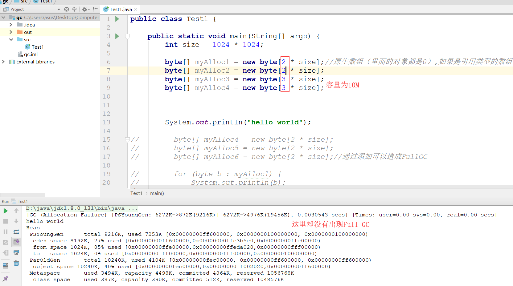

# 垃圾回收机制

## JVM垃圾回收器理论分析与讲解
    1. 内存结构与内存分配
        <1> 内存结构图，如下

        <2> 内存分配
            1) 堆上分配
                * 大多数情况在eden上分配，偶尔会直接在old（老年代）上分配。细节取决于GC的实现

            2) 栈上分配
                * 原子类型的局部变量是在栈中进行分配的

    2. 内存回收
        <1> 垃圾回收要做的是将那些dead的对象所占有的内存回收掉
            * Hotspot虚拟机认为没有引用的对象是dead的

            * Hotspot将引用分为4种：Strong（强引用，大部分情况都是这种）、Soft（软引用）、Weak（弱引用）、Phantom
                                  （虚引用）

                * Strong即默认通过Object o = new Object()这种方式赋值的引用

                * Soft、Weak、Phantom这三种都是继承Reference

        <2> 在Full GC时会对Reference类型的引用进行特殊处理
            * Soft：内存不够时，一定会被垃圾回收、长期不用也会被垃圾回收

            * Weak：一定会被垃圾回收，当被mark为dead，会在ReferenceQueue中通知

            * Phantom：本来就没有引用，当从jvm heap中释放时会通知

    3.垃圾收集算法

        <1> GC的时机
            * 在分代模型的基础上，GC从时机上分为2种：Scavenge GC 和 Full GC
                
                1) Scavenge GC(Minor GC)
                    * 触发时机：新对象生成时，eden空间满了

                    * 理论上Eden区大多数对象会在Scavenge GC回收，赋值算法的执行效率会很高，Scavenge GC时间比较短

                2) Full GC
                    * 对整个JVM进行整理，包括新生代、老年代和永久代

                    * 主要触发时机：老年代满了、永久代满了、调用System.gc()

                    * 效率很低，尽量减少Full GC

        <2> 垃圾回收器
            * 分代模型：GC的宏观愿景

            * 垃圾回收器：GC的具体实现

            * Hotspot JVM提供多种垃圾回收器，我们需要根据具体的应用需求采用不同的回收器

            * 没有万能的垃圾回收器，每种垃圾回收器都有自己的适用场景

        <3> 垃圾回收器的并行与并发
            * 并行(parallel)：指多个收集器的线程同时工作，但是用户线程处于等待状态

            * 并发(Concurrent)：指收集器在工作的同时，可以允许用户线程工作

                * 并发不代表解决了GC停顿问题了，在关键的步骤还是要停顿。比如在收集器标记垃圾的时候。但在清除垃圾的
                  时候，用户线程可以和GC线程并发执行
            
        <4> Serial收集器
            * 单线程收集器，收集时会暂停所有工作线程(Stop The World 简称STW)，使用复制收集算法，虚拟机运行在Client
              模式时的默认新生代收集器

            * 最早的收集器，单线程进行GC

            * 新生代和老年代都可以使用

            * 在新生代，采用复制算法，在老年代，采用Mark-Compact算法

            * Hotspot Client模式缺省的收集器

        <5> ParNew收集器
            * Parnew收集器就是Serial的多线程版本，除了使用多个收集线程以外，其余行为包括算法、STW、对象分配规则、回
              收策略等都与Serial收集器一样

            * 对应的这种收集器时虚拟机运行在Server模式的默认新生代收集器，在单CPU的环境中，Parnew收集器并不会比Seri
              al收集器有更好的效果

            * 是Serial收集器在新生代的多线程版本

            * 使用复制算法（因为针对新生代）

            * 只有在多CPU的环境下，效率才会比Serial收集器高

            * 可以通过-XX:ParallelGCThreads来控制GC线程的多少。需要结合CPU的个数

            * Server模式下新生代的缺省收集器

        <6> Parallel Scavenge收集器
            * Parallel Scavenge收集器也是一个多线程收集器，也是使用复制算法，但它的对象分配规则与回收策略都与ParNew
              收集器有所不同，它是以吞吐量最大化（既GC时间占总运行时间最小）为目标的收集器实现，它允许较长时间的STW换
              取总吞吐量最大化

        <7> Serial Old收集器
            * Serial Old是单线程收集器，使用标记-整理算法，是老年代的收集器。

        <8> Parallel Old收集器
            * 老年代版本吞吐量优先收集器，使用多线程和标记整理算法，JVM1.6提供，在此之前，新生代使用了PS收集器的话，
              老年代除Serial Old外别无选择，因为PS无法与CMS收集器配合工作。

            * Parallel Scavenge在老年代的实现

            * 在JVM1.6才出现Parallel Old

            * 采用多线程，Mark-Compact算法
            
            * 更注重吞吐量

            * Parallel Scavenge + Parallel Old = 高吞吐量，但GC停顿可能不理想

        <9> CMS(Concurrent Mark Sweep)收集器
            * CMS是一种以最短停顿时间为目标的收集器，使用CMS并不能够达到GC效率最高(总体GC时间最小)但它能尽可能降低垃
              圾回收时服务的停顿时间，CMS收集器使用的是标记清除算法

            * 追求最短停顿时间，非常适合Web应用

            * 针对老年代，一般结合ParNew使用

            * Concurrent，垃圾回收线程和用户线程并发工作（尽量并发）

            * 只有在多CPU环境下才有意义

            * 使用-XX:UseConcMarkSweepGC打开

            * CMS的缺点：
                1) CMS以牺牲CPU资源的代价来减少用户线程的停顿，当CPU个数少于4时，有可能对吞吐量影响非常大

                2) CMS在并发清理过程中，用户线程还在抛。这时候需要预留一部分空间给用户线程

                3) CMS用标记-清理算法，会带来碎片问题，碎片过多的时候容易频繁触发Full GC

    4. GC垃圾收集器的JVM参数定义

## Java内存泄露经典原因分析
    1. 对象对象定义在错误的范围(Wrong Scope)
        * 如果Foo实例对象的生命较长，会导致临时性内存溢出（这里的names变量其实只有临时作用）

        * JVM喜欢生命周期短的对象，这样做已经足够高效

        * 分析：为什么第一种定义方式会导致临时性内存溢出？
                * 因为第一种定义的names为成员变量，成员变量是随着类的诞生而诞生的，随着类的消亡而消亡的，而names只在
                  doIt方法中使用，如果后面类Foo一直存活，那么该成员变量也一直存活着

                * 而第二种方式names为局部变量，随着方法的消亡而消亡v

    2. 异常(Exception)处理不当(这里的资源关闭必须在finally代码块中)

    3. 集合数据管理不当
        * 当使用Array-based的数据结构（ArrayList，HashMap等）时，尽量减少resize
            * 比如new ArrayList时，尽量估算size，在创建的时候把size确定

            * 减少resize可以避免没有必要的array copying，gc碎片等问题

        * 如果一个list只需要顺序访问，不需要随机访问(Random Access)用LinkedList代替ArrayList
            * LinkedList本质是链表，不需要resize，但只适用于顺序访问

## 垃圾回收日志与算法深度分析

    1. 首先，我们定义一个简单的程序，为程序加上一些虚拟机参数来详细了解里面的内容

        <1> 程序如下

        <2> 接下来我们为该程序加上虚拟机参数
            * -verbose:gc：表示会输出详细的垃圾回收的日志

            * -Xms20M：表示堆容量的初始值为20M

            * -Xmx20M：表示堆容量的最大值为20M

            * -Xmn10M：表示新生代的大小为10M

            * -XX:+PrintGCDetails：打印垃圾回收的详细信息

            * -XX:SurvivorRatio=8：表示eden空间与survivor空间比例是8:1

        <3> 运行结果如下
            * 在增加了数组size或增加了数组对象的时候，会出现如下结果：
            

            * 当我们减少数组size或减少数组对象，会出现如下结果：

            * 继续减少数组对象（也可以缩小size），得到如下结果：

        <4> 接下来，我们详细分析一下GC的日志信息
            * 我们调整到这样的信息

            * 详细分析第一行内容的数据信息

            * 查看接下来的相关信息

            * 探讨相关数据是如何生成的

## 新生代与老年代垃圾收集器实现详解
    1. 我们修改一下代码，得到如下结果

    2. 观察下图发现，在Full GC中涉及到了新生代，老年代以及元空间之间的垃圾回收，同样可以应证我们之前的结论：在元空间中
        进行垃圾回收效率极低，下图也证明了元空间中的垃圾回收并没有回收到任何信息

    3. 接下来，我们就对Full GC的内容进行详细分析
        * Full GC的相关分析

        * 以下就是老年代不减反增的情况

        * 详细信息分析

    4. 值得思考的一个问题是：为什么在总容量小的时候会出现Full GC，而在总容量大的时候却不会出现Full GC（容量都在10M之内）
       如下图所示

        * 相关补充：当新生代已经无法容纳下一个新创建的对象，那么这个新创建的对象会直接在老年代诞生

        * 对图中参数的分析
            * 在没有执行垃圾收集器的情况下JVM会使用默认的收集器，在新生代使用的是PSYoungGen（也就是Parallel Scavenge）
              而在老年代则会使用ParOldGen(Parallel Old),在jdk1.8版本中

