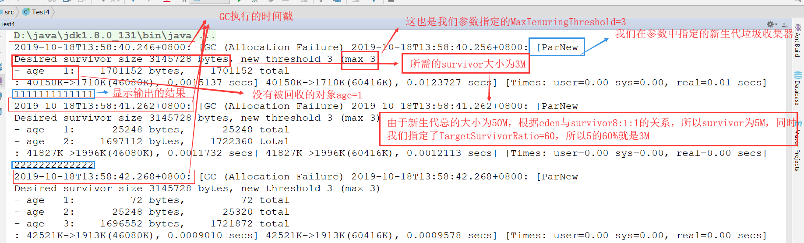

# 垃圾回收机制

## 阈值和垃圾收集器类型对于对象分配的影响实战分析
    1. 演示Test2的相关内容
        <1> 首先，我们了解一下相关的JVM参数
            java -XX:+PrintCommandLineFlags -version：表示打印出当前java和JVM的版本号，同时将JVM默认的启动
                                                      参数打印出来（如下）
                                                

        <2> 接下来我们对Test2加入一些JVM参数（前面六个参数与Test1一致）
            * -verbose:gc：表示会输出详细的垃圾回收的日志

            * -Xms20M：表示堆容量的初始值为20M

            * -Xmx20M：表示堆容量的最大值为20M

            * -Xmn10M：表示新生代的大小为10M

            * -XX:+PrintGCDetails：打印垃圾回收的详细信息

            * -XX:SurvivorRatio=8：表示eden空间与survivor空间比例是8:1      

            * -XX:PretenureSizeThreshold=4194304（大小阈值,该数字以byte为单位）:表示当我们要创建的对象的大小
                                         表示4M                             如果超过了我们指定的该值，该对
                                                                            象就不会在新生代去分配，而是直
                                                                            接进到老年代（设置对象超过指定
                                                                            值时直接在老年代进行分配）

        <3> 加入参数后运行结果如下

            * 答案如下：
                * JVM很多参数是交织在一起的，也就是说当A参数出现B参数才会起作用，A参数不出现，那么B参数就不会起
                  作用。而在这里PretenureSizeThreshold参数需要与串行的垃圾收集器（即Serial GC）搭配使用。

        <4> 因此，我们就需要在JVM参数中指定垃圾收集器为Serial GC，也就是需要加上参数-XX:+UseSerialGC,运行结果
            如下

    2. 对Test2程序进行改造
        <1> 首先将我们最后添加的JVM参数-XX:+UseSerialGC删除，然后对代码进行修改，将myAlloc的size修改为8M，如下

            * 此时运行结果如下，也发生了变化，如下

        <2> 继续修改将myAlloc的size由8M修改为10M，运行结果如下

    3. 接下来我们使用JVM相关的工具来进行验证
        <1> 首先我们将JVM参数-XX:+UseSerialGC加上，为了能够观察到效果我们在代码中让线程休眠一会，如下

        <2> 运行程序，通过jvisualvm来观察，如下

        <3> 当我们点击执行垃圾回收时，就会执行一次System.gc(),如下

            * 关于System.gc()的解释描述
                * Sysytem.gc()告诉JVM要执行垃圾回收，是一次Full GC，但是是不是会执行，什么时候执行是不确定
                  的，是JVM自确定的，那么调用Sysytem.gc()的意义是什么呢？如果不调用Sysytem.gc()，在所有的
                  情况下，当执行垃圾回收的唯一的可能因素都是在创建对象的时候（Sysytem.gc()就是可以在没有创
                  建对象的时候能够执行垃圾回收，而其他所有情况执行垃圾回收一定是因为对象在创建过程中，内存不
                  够才会导致垃圾回收）

    4. 使用jmc查看该程序
        <1> 查看运行结果后，我们发现eden空间的变化，当使用量快达到100%时，就会执行一次GC，空间会立马得到释放

    5. 使用jcmd相关命令了解Test2程序
        <1> 查看JVM的启动参数

## MaxTenuringThreshold与阈值的动态调整详解
    1. 在进行相关实验之前我们需要明白：
        <1> 在默认情况下，当我们新建对象时，对象首先会在新生代的eden空间，完成对象的创建，当对象创建完之后，如
            果空间不够的话，在新生代就会执行一次minor GC，如果一个对象经历了GC没有被回收掉的话，那么这个对象将
            会进入到当时的to survivor中，在经过一段时间后（有对象在创建），可能会再次进行垃圾回收，执行之后，之
            前在to Survivor 的对象就会变成From Survivor，如此循环变化。这时就可能会有对象在to Survivor与
            from Survivor之间一直转换，也就是说这个对象一直存活，JVM是如何处理这部分对象的呢？这时，如果一个对
            象经历了几次GC之后还没有回收，依然没有被回收的话，那么该对象就不会再处于新生代（这是因为新生代采用
            复制算法，如果有很多对象经过多轮垃圾回收之后依然存活，那么首先会对效率有很大的影响，其次会导致Surv
            iuvor空间的浪费。因此，JVM就会将这些对象晋升为老年代（在之后进行Minor GC就不会对该对象进行回收了）
            同时，该对象晋升为老年代，新生代的空间也就得到了释放，那么对下次Minor GC来说，就提高了效率，也就是
            降低了时间成本，同样也会降低空间成本

    2. 接下来，我们就对新的程序Test3进行分析，程序如下

        <1> -XX:MaxTenuringThreshold=5：设置晋升到老年代的对象的最大的存活年龄（在可以自动调节对象晋升到老年代
                                      的GC中，设置该阈值的最大值）

            * 注意：
                1) 当一个对象在一次GC之后存活就可以认为对象的年龄可以加1，也就是说，经历过几次垃圾回收年龄就是
                   多少。在我们设置了上面值的情况下，就是说对象的年龄大于了5的话，这时该对象就会从新生代变换为
                   老年代（这是一种极其理想的情况）

                2) 我们设置的值只是理论上的最大值，就我们设置的大小而言，可能当对象的年龄为2就可能被垃圾回收，
                   这是因为JVM可以自动的调节对象晋升为老年代的阈值，但是这个阈值一定是不会大于5的

                   大值是1111，也就是15)

        <2> -XX:+PrintTenuringDistribution：打印出年龄为x的对象有多少个

        <3> 经历了多次GC后，存活的对象会在from Survivor和to Survivor之间来回存放，而这里的一个前提就是这两个空
            间有足够的大小来存放这些数据，在GC算法中会计算每个对象的大小，如果达到某个年龄后发现总大小已经达到了
            Survivor空间的50%，那么这时需要调整阈值，不能继续等到默认的15次gc后才完成晋升，因为这样会导致Survi
            vor空间不足，所以需要调整阈值，让这些存活对象尽快完成晋升

    3. 运行Test3（加上了启动参数之后）结果如下

## 实例演示MaxTenuringThreshold参数及阈值动态调整策略
    1. 接下来我们通过一个新的Test4来详细了解MaxTeuringThreshold参数及阈值动态调整策略
        <1> 首先我们先定义一个Test4进行测试，如下：

        <2> 接下来为该程序添加上JVM参数
            * -verbose:gc

            * -Xmx200M：最大的堆空间大小为200m

            * -Xmn50M：新生代大小为50M

            * -XX:TargetSurvivorRatio=60：对survivor空间进行配置，当某个survivor的存活对象占据60%，就会重新
                                          计算对象晋升的阈值，而不会使用之前显示配置的MaxTeuringThreshold的
                                          值

            * -XX:+PrintTenuringDistribution：打印对象在survivor空间中年龄的情况（有多少对象age为1，多少为2
                                              等）

            * -XX:+PrintGCDetails

            * -XX:+PrintGCDateStamps:打印出当前GC执行的时间戳

            * -XX:+UseConcMarkSweepGC:指定CMS垃圾收集器（老年代）

            * -XX:+UseParNewGC:指定新生代使用ParNew垃圾收集器

            * -XX:MaxTenuringThreshold=3:对象在新生代存活的最大年龄为3

        <3> 增加参数运行结果如下

            * 结果分析：

            * 值得注意的是：
                1) 当如果new threshold为1的话，就会一次性将新生代所有的对象都晋升为老年代。这也就印证了所有的
                   from survivor和to survivor都为空

## 安全点与安全区域详解
    1. CMS垃圾收集器(Concurrent Mark Sweep)
        <1> 枚举根节点
            * 当执行系统停顿下来之后，并不需要一个不漏地检查完所有执行上下文和全局的引用位置，虚拟机应当是有办法直
              接得知哪些地方存放着对象引用。在HotSpot的实现中，是使用一组称为OopMap的数据结构来达到这个目的的。 

        <2> 安全点
            * 在OopMap的协助下，HotSpot可以快速且准确地完成GC Roots枚举，但一个很现实的问题随之而来：可能导致引
              用关系变化，或者说OopMap内容变化的指令非常多，如果为每一条指令都生成对应的OopMap，那将会需要大量的
              额外空间，这样GC的空间成本将会变得更高。

            * 实际上，HotSpot并没有为每条指令都生成OopMap，而只是在“特定的位置”记录了这些信息，这些位置称为安全
              点（Safepoint） ,既程序执行时并非在所有地方都能停顿下来开始GC，只有在达到安全点时才能暂停。通俗的
              说，当JVM遇到空间不够的时候会执行垃圾回收，但并不是在系统的任何时刻都可以执行垃圾回收，必须要等到程
              序执行到一个称之为安全点这样的一个位置上才可以进行GC。

            * Safepoint的选定既不可能太少以至于让GC等待时间太长，也不能过于频繁以至于过分增大运行时的负载。所以，
              安全点的选定基本上是以“是否具有让程序长时间执行的特征”为标准进行选定的————因为每条指令执行的时间非
              常短暂，程序不太可能因为指令流长度太长这个原因而过长时间执行，“长时间执行”的最明显特征就是指令序列
              复用，例如方法调用、循环跳转、异常跳转等，所以具有这些功能的指令才会产生Safepoint。

            * 对于Safepoint，另一个需要考虑的问题是如何在GC发生时，让所有线程(这里不包括执行JNI调用的线程)都“跑”
              到最近的安全点上再停顿下来：抢占式中断(Preemptive Suspension)和主动式中断(Voluntary Suspension)
                
                1) 抢占式中断：它不需要线程的执行代码主动去配合，在GC发生时，首先把所有线程全部中断，如果有现成中
                              断的地方不在安全点上，就恢复线程，让它“跑”到安全点上

                2) 主动式中断：当GC需要中断线程的时候，不直接对线程操作，仅仅简单地设置一个标志，各个线程执行时主
                              动去轮循这个标志，发现中断标志为真时就自己中断挂起。轮循标志的地方和安全点是重合的
                              另外再加上创建对象需要分配内存的地方。
                              
                3) 注意：现在几乎没有虚拟机采用抢占式中断来暂停线程从而响应GC事件。

        <3> 安全区域(Safe Region)
            * 在使用Safepoint似乎已经完美地解决了如何进入GC的问题，但实际上情况却并不一定。Safepoint机制保证了程
              序执行时，在不太长的时间内就会遇到可进入GC的Safepoint。但如果程序在“不执行”的时候呢？所谓程序不执行
              就是没有分配CPU时间，典型的例子就是处于Sleep状态或者Blocked状态，这时候线程无法响应JVM的中断请求，
              JVM也显示不太可能等待线程重新分配CPU时间。对于这种情况，就需要安全区域（SafeRegin）来解决了。

            * 在线程执行到Safe Region中的代码时，首先标识自己已经进入了Safe Region，那样，当在这段时间里JVM要发
              起GC时，就不用管标识自己为Safe Region状态的线程了，在线程要离开Safe Region时，它要检查系统是否已经
              完成了根节点枚举（或者是整个GC过程），如果完成了，那线程就继续执行，否则它就必须等待直到收到可以安全
              离开Safe Region的信号为止

            

        

 

            

