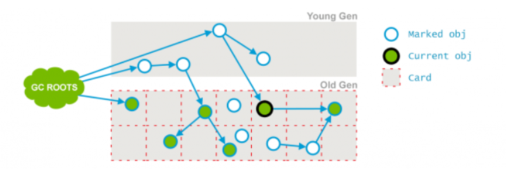

# 垃圾回收机制

## CMS垃圾收集器深入讲解
    1. CMS垃圾收集器解析
        <1> CMS(Concurrent Mark Sweep)收集器,以获取最短回收停顿时间为目标，多数应用于互联网站或者B/S系统的服务
            器端

        <2> CMS是基于“标记-清除”算法实现的，整个过程分为4个步骤：
            * 初始标记(CMS initial mark)

            * 并发标记(CMS concurrent mark)

            * 重新标记(CMS remark)

            * 并发清除(CMS concurrent sweep)

        <3> 详解
            1) 其中，初始标记和重新标记者两个步骤仍然需要“Stop The World”

            2) 初始标记只是标记一下GC Roots能直接关联到的对象，速度很快

            3) 并发标记阶段就是进行GC Roots Tracing的过程（GC Roots Tracing就是指从GC Roots开始找到GC Roots去引用
               或者关联的对象，从这个对象出发，然后向后面寻找，能引用或者关联到的所有其他对象）

            4) 重新标记阶段则是为了修正并发标记期间因用户程序继续运作而导致标记产生变动（这是前面并发标记产生的结果，业
               务线程与垃圾清理线程在同时执行）的那一部分对象的标记记录，这个阶段的停顿时间一般会比初始标记阶段稍长一些，
               但远远比并发标记时间短

            5) CMS收集器的运作步骤如下图所示，在整个过程中耗时最长的并发标记和并发清除过程收集器线程都可以与用户线程一
               起工作，因此从总体看，CMS收集器的内存回收过程是与用户线程一起并发执行的

                * 观察下图，我们发现初始标记和重新标记都是没有用户线程执行的，这是因为这两个步骤都需要Stop The World
                  也就是用户线程都会暂停，而并发标记和并发清除都是可以与用户线程一起执行的

        <4> 优点与缺点
            1) 优点：
                * 并发收集，低停顿，Oracle公司的一些官方文档中也称之为并发低停顿收集器(Concurrent Low Pause Collector)

            2) 缺点：
                * CMS收集器对CPU资源非常敏感

                * CMS收集器无法处理浮动垃圾（Floating Garbage，由于CMS并发清理阶段用户线程还在运行着，伴随程序的运行自
                  然还会有新的垃圾不断产生，这一部分垃圾出现在标记过程之后，CMS无法在本次收集中处理掉它们，只好留待下一
                  次GC时再将其清理掉。这一部分垃圾就称为“浮动垃圾”）,可能出现“Concurrent Mode Failure”失败而导致另一
                  次Full GC的产生。如果在应用中老年代增长不是太快，可能适当调高参数-XX：CMSInitiatingOccupancyFract
                  ion的值来提高触发百分比，以便降低内存回收次数从而获取更好的性能。要是CMS运行期间预留的内存无法满足程
                  序需要时，虚拟机将启动后备预案:临时启用Serial Old收集器来重新进行老年代的垃圾收集，这样停顿时间就很长
                  了。所以说参数-XX：CMSInitiatingOccupancyFraction设置得太高很容易导致大量“Concurrent Mode Failure”
                  失败，性能反而降低。

                * 收集结束时会有大量空间碎片产生，空间碎片过多时，将会给大对象分配带来很大麻烦，往往出现老年代还有很大
                  空间剩余，但是无法找到足够大的连续空间来分配当前对象，不得不提前进行一次Full GC。CMS收集器提供了一个
                  -XX:+UseCMSCompactAtFullCollection开关参数（默就是开启的），用认于在CMS收集器顶不住要进行Full GC时
                  开启内存碎片的合并整理过程，内存整理的过程是无法并发的，空间碎片问题没有了，但停顿时间不得不变长。

        <5> 空间分配担保
            * 在发生Minor GC之前，虚拟机会先检查好老年代最大可用连续空间是否大于新生代所有对象总空间，如果这个条件成立，
              那么Minor GC可以确保是安全的。当大量对象在Minor GC后仍然存活，就需要老年代进行空间分配担保，把Survivor
              无法容纳的对象直接进入到老年代，如果老年代判断到剩余空间不足（根据以往每一次回收晋升到老年代对象容量的平
              均值作为经验值），则进行一次Full GC

    2. CMS收集器的收集步骤
        <1> 七个详细步骤：
            1) Phase1 ：Initial Mark   初始标记

            2) Phase2 : Concurrent Mark   并发标记

            3) Phase3 : Concurrent Preclean    并发预先清理

            4) Phase4 : Concurrent Abortable Preclean  并发可能失败的预先清除

            5) Phase5 : Final Remark   最终重新标记

            6) Phase6 : Concurrent Sweep   并发清除

            7) Phase7 : Concurrent Reset   并发重置

        <2> Phase1 ：Initial Mark 
            * 这个是CMS两次stop-the-world事件的其中一次，这个阶段的目标是：标记那些直接被GC root引用或被年轻代存活对象
              所引用的所有对象。如下图所示，绿色的被标记的点要么是直接被GC root引用，要么就是被新生代存活对象引用

        <3> Phase2 : Concurrent Mark
            * 在这个阶段Garbage Collector会遍历老年代，然后标记所有存活的对象，它会根据上个阶段找到GC ROOTS遍历查找。
              并发标记阶段，它会与用户的应用程序并发运行。并不是老年代所有的存活对象都会被标记，因为在标记期间用户的程序
              可能会改变一些引用。如下图所示，有些老年代对象已经没有被引用指向了，成为了垃圾，这就是因为用户线程在垃圾回
              收时是同时执行的，可能会改变引用

        <4> Phase3 : Concurrent Preclean
            * 这也是一个并发的阶段，与应用线程并发运行，并不会stop应用的线程。在并发运行过程中，一些对象的引用可能会发生
              变化，但是这种情况发生时，JVM会将包含这个对象的区域(Card)标记为Dirty，这就是Card Marking（区域标记）

            * 在pre-clean阶段，那些能够从Dirty对象到达的对象也会被标记，这个标记做完之后，dirty card标记就会被清除了

            * 如下图所示，红色部分就是对象引用可能会发生变化的区域，也就是dirty Card，然后就会从该区域向后面寻找能够被
              该区域里面能够引用的对象，当能够被引用的对象也被标记完之后，那么dirty card就会被删除，如下面第二幅图所示，
              在标记完红色区域的引用的下一个对象后，dirty card就被清除了

        <5> Phase4 : Concurrent Abortable Preclean
            * 这也是一个并发阶段，但是同样不会影响用户的应用线程，这个阶段是为了尽量承担STW(Stop The World)中最终标记
              阶段的工作(目的也是为了实现减少STW的停顿时间)。这个阶段持续时间以来很多因素。由于这个阶段是在重复很多相同
              的工作，直接满足一些条件(比如：重复迭代的次数，完成的工作量或者时钟时间等)

        <6> Phase5 : Final Remark
            * 这是第二个STW阶段，也是CMS中最后一个，这个阶段的目标是标记老年代所有的存活对象，由于在之前阶段是并发执行
              的。gc线程可能跟不上应用程序的变化，为了完成标记老年代所有存活对象的目标，STW就非常有必要了

            * 通常CMS的Final Remark阶段会在年轻代尽可能干净的时候运行，目的是为了减少连续的STW发生的可能性(年轻代存活
              对象过多的话，也会导致老年代涉及的存活对象越多，这是因为有一部分的新生代对象会晋升为老年代)。这个阶段会比
              前面几个阶段复杂一些

            * 那么，自此标记阶段就完毕了，经过前面这五个阶段，老年代所有存活对象都被标记过了，接下来就可以通过清除算法去
              清理那些老年代不再使用的对象了

        <7> Concurrent Sweep
            * 这里不需要STW，它是与用户的应用程序并发运行，这个阶段是清除那些不再使用的对象，回收它们的占用空间为将来使
              用

        <8> Concurrent Reset
            * 这个阶段也是并发执行的，它会重设CMS内部的数据结构，为下次GC做准备

    3. 总结
        * CMS通过将大量工作分散到并发处理阶段来减少STW时间，在这块做的很好，但是存在一些其他问题

            * 问题：    
                1) CMS收集器无法处理浮动垃圾（Floating Garbage）,可能出现“Concurrent Mode Failure”失败而导致另一次
                   Full GC的产生，可能引发串行Full GC (CMS有一个后备垃圾收集器 Serial Old，只要CMS遇到“Concurrent 
                   Mode Failure等无法处理的情况，就会使用Serial Old进行一次 Full GC)

                2) 空间碎片，导致无法分配大对象，CMS收集器提供了一个-XX:+UseCMSCompactAtFullCollection开发参数（默认
                   就是开启的），用于在CMS收集器顶不住要进行Full GC时开启内存碎片的合并整理过程，内存整理的过程是无法并
                   发的，空间碎片问题没有了，但停顿时间不得不变长

                3) 对于堆比较大的应用，GC的时间难以预估

## 实例透彻分析CMS垃圾收集器的执行过程
    1. 接下来我们用一个程序来演示CMS的运行过程
        <1> 程序如下

        <2> 接下来我们为该程序加上相关的jvm参数，如下所示

        <3> 运行结果如下

## GC注意事项总结
    1. 为什么JVM在新生代使用复制算法，在老年代使用标记整理和标记清除算法？
        1) 对Java而言大多数对象都是朝生夕灭，大部分新的对象都是在新生代创建的，对象在创建之后很快就被判断为垃圾，复制
           算法在复制时，存活对象不能太多，否则消耗过多内存空间。而在老年代中，对象的存活时间比较长，如果使用复制算法，
           那么会消耗巨大的内存空间
    
        2) 新生代中如果to survivor中存活不下复制的对象，那么老年代就会成为它的分配担保措施，也就是如果to Survivor存
           放不下，那么就会在老年代存放。而老年代而言，已经没有能够为其作为分配担保的区域了

    2. 标记整理解决了标记清除中内存碎片的问题，但是整体而言，标记整理的效率是不如标记清除的，因为标记整理有一个整理过程

    3. CMS垃圾回收就是将一个可以完成的过程(如标记、清理)分为多个过程执行完，已达到用户线程的停顿时间最短

